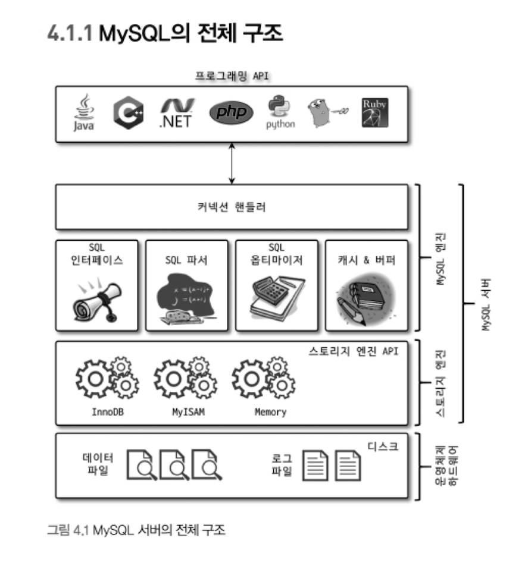
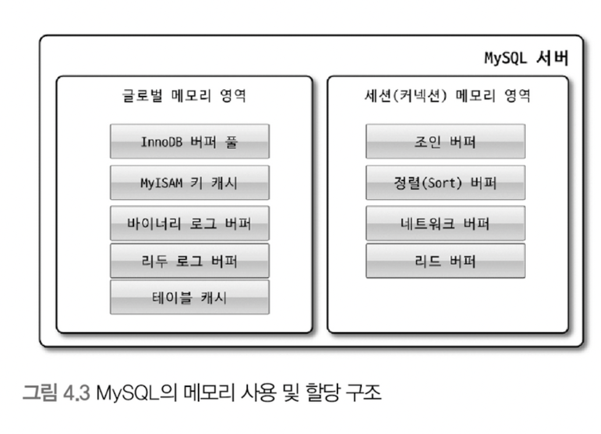

# 아키텍처

## MySQL 엔진 아키텍처

### MySQL의 전체 구조

- MySQL 서버는 크게 MySQL 엔진과 스토리지 엔진으로 구성되어 있다. 
- 비유하자면, MySQL 엔진은 사람의 머리고, 스토리지 엔진은 사람의 손발이다.
- MySQL 접속 드라이버를 이용해 대부분의 언어로 MySQL 서버에 접속할 수 있다. 

#### MySQL 엔진
- 요청된 SQL 문장을 분석하고 최적화 한다.
- 한개만 사용 가능하다.
- 구성요소
  - 커넥션 핸들러: Client로부터 접속 및 쿼리 요청을 처리
  - SQL 파서 및 전처리기
  - 옵티마이저
  - 캐시 & 버퍼

#### 스토리지 엔진
- 스토리지 엔진을 통해 디스크 스토리지에 데이터를 읽고 쓴다.
- InnoDB, MyISAM, Memory 등 다양한 스토리지 엔진이 있다.
- 여러 개를 동시에 사용할 수 있다.

#### 핸들러 API
- MySQL 엔진의 쿼리 실행기에서 스토리지 엔진에게 읽기 혹은 쓰기 요청을 한다.
- 이러한 요청을 처리하는 인터페이스를 핸들러 API라고 한다.

### MySQL 스레딩 구조

- MySQL 서버는 프로세스 기반이 아닌 스레드 기반으로 작동한다.
- 포그라운드 스레드와 백그라운드 스레드로 구분할 수 있다.

#### 포그라운드 스레드
- MySQL 서버에 접속된 클라이언트의 수만큼 존재한다
- 각 클라이언트 사용자가 요청하는 쿼리 문장을 처리한다.
- client 사용자가 작업을 마친뒤 커넥션을 종료하면 해당 커넥션을 담당하던 스레드는 다시 스레드 캐시(Thread cache)로 되돌아간다.
- MySQL의 데이터 버퍼나 캐시로 부터 데이터를 조회하며, 버퍼나 캐시에 없는 경우 디스크의 데이터나 인덱스 파일로부터 데이터를 조회한다.
  - MyISAM 테이블은 디스크 쓰기 작업까지 포그라운드 스레드가 처리한다.
  - InnoDB 테이블은 데이터 버퍼나 캐시까지만 포그라운드 스레드가 처리하고, 디스크 쓰기 작업은 백그라운드 스레드가 처리한다.

#### 백그라운드 스레드
- 백그라운드 스레드로 처리하는 작업
  - 인서트 버퍼를 병합하는 스레드
  - **로그를 디스크로 기록하는 스레드**
  - **InnoDB 버퍼 풀의 데이터를 디스크에 기록하는 스레드**
  - 데이터를 버퍼로 읽어 오는 스레드
  - 잠금이나 데드락을 모니터링하는 스레드
- 데이터를 읽는 작업은 주로 Client 스레드에서 처리되기 때문에 읽기 스레드는 많이 설정할 필요가 없다.
- 쓰기 스레드는 아주 많은 작업을 백그라운드로 처리하기 때문에 디스크를 최적으로 사용할 수 있을 만큼 스레드 개수를 설정하는 것이 좋다.

### 메모리 할당 및 사용자 구조

- MySQL 서버에서 사용되는 메모리 공간은 크게 글로벌 메모리 영역과 로컬 메모리 영역으로 구분할 수 있다.

#### 글로벌 메모리 영역
- client 스레드 수와 무관하게 하나의 메모리 공간만 할당된다.
- 모든 스레드에 의해 공유된다.
- 글로벌 메모리 영역 종류
  - 테이블 캐시
  - InnoDB 버퍼 풀
  - InnoDB 어댑티브 해시 인덱스
  - InnoDB 리두 로그 버퍼

#### 로컬 메모리 영역
- 세션 메모리 영역이라고도 한다.
- 클라이언트 스레드가 쿼리를 처리하는데 사용하는 메모리 영역이다.
- 각 클라이언트 스레드별로 독립적으로 할당되며 절대 공유되어 사용되지 않는다는 특징이 있다.
- 로컬 메모리 영역 종류
  - 정렬 버퍼
  - 조인 버퍼
  - 바이너리 로그 캐시
  - 네트워크 버퍼


### 플러그인 스토리지 엔진 모델

- MySQL의 독특한 구조 중 하나가 바로 플러그인 모델이다.
- 스토리지 엔진뿐만 아니라 검색어 파서, 사용자의 인증 등도 모두 플러그인으로 구현되어 제공된다.
- MySQL은 이미 기본적으로 많은 스토리지 엔진을 가지고 있다. 
- 하지만 사용자의 요구 조건을 만족시키기 위해 부가적인 기능을 더 제공하는 스토리지 엔진이 필요할 수 있으며, 이를 위해 직접 스토리지 엔진을 개발하는 것도 가능하다.
- MySQL에서 쿼리가 실행되는 과정은 아래와 같다.
```
💡 SQL 파서 <--> SQL 옵티마이저 <--> SQL 실행기 <--> 데이터 읽기/쓰기 <--> 디스크
   |              MySQL 엔진                 |       스토리지 엔진 | 
```
- **MySQL 엔진이 스토리지 엔진에게 데이터를 읽어오거나 저장하도록 명령하려면 반드시 핸들러를 통해야 한다.**
- 실질적인 GROPU BY나 ORDER BY 등 복잡한 처리는 스토리지 엔진 영역이 아니라 MySQL 엔진의 처리 영역인 ‘쿼리 실행기’ 에서 처리된다.
- 중요한 점은 하나의 쿼리 작업은 여러 하위 작업으로 나뉘는데, 각 하위 작업이 MySQL 엔진 영역에서 처리되는지 아니면 스토리지 엔진 영역에서 처리되는지 구분할줄 알아야 한다는 점이다.

### 컴포넌트
- MySQL8.0부터 플러그인의 단점을 개선하기 위해 컴포넌트를 지원한다.
- 플러그인 단점
  - 플러그인은 오직 MySQL 서버와 인터페이스할 수 있고, 플러그인끼리는 통신할 수 없음
  - 플러그인은 MySQL 서버의 변수나 함수를 직접 호출하기 때문에 안전하지 않음(캡슐화 안됨)
  - 플러그인은 상호 의존 관계를 설정할 수 없어서 초기화가 어려움

### 쿼리 실행 구조


#### 쿼리 파서
- 사용자 요청으로 들어온 쿼리 문장을 토큰으로 분리해 트리 형태의 구조로 만들어 내는 작업을 의미한다.
- 쿼리 문장의 기본 문법 오류는 이 과정에서 발견되고 사용자에게 오류 메시지를 전달하게 된다.

#### 전처리기
- 파서 과정에서 만들어진 파서 트리를 기반으로 쿼리 문장에 구조적인 문제점이 있는지 확인한다.
  - 각 토큰을 테이블 이름, 칼럼 이름, 또는 내장 함수와 같은 객체의 존재여부, 객체의 접근 권한 등
- 실제 존재하지 않거나 권한상 사용할 수 없는 개체의 토큰은 이 단계에서 걸러진다.

#### 옵티마이저
- 쿼리를 저렴한 비용으로 가장 빠르게 처리할지를 결정하는 DBMS의 두뇌 역할을 담당한다. 

#### 실행 엔진(쿼리 실행기)
- 실행 엔진과 핸들러는 손과 발에 비유할 수 있다.
- 또다른 비유
  - 옵티마이저: 경영진
  - 실행 엔진: 중간 관리자
  - 핸들러: 각 업무의 실무자
- 즉, 실행 엔진은 만들어진 계획대로 각 핸들러에게 요청해서 받은 결과를 또 다른 핸들러 요청의 입력으로 연결하는 역할을 수행한다.

#### 핸들러(스토리지 엔진)
- 핸들러는 MySQL 서버의 가장 밑단에서 MySQL 실행 엔진의 요청에 따라 데이터를 디스크로 저장하고 읽어 오는 역할을 담당한다.
- 핸들러는 스토리지 엔진을 의미한다.

### 복제
- 복제는 매우 중요한 역할을 담당하고, 지금까지 MySQL 서버에서 많은 발전을 거듭해왔다.
- 자세한 내용은 16장’복제’에서 살펴 보자.

### 쿼리 캐시
- SQL의 실행 결과를 메모리에 캐시하고, 동일 SQL 쿼리가 실행되면 테이블을 읽지 않고 즉시 결과를 반환하기 때문에 매우 빠른 성능을 보였다.
- 하지만 테이블의 데이터가 변경되면 캐시에 존재하는 변경 이전의 데이터를 삭제해야 했다.
- 이는 심각한 동시 처리 성능 저하를 유발한다.
- 결국 MySQL 8.0에서 완전히 제거 되었다.

### 스레드 풀
- MySQL 서버 엔터프라이즈 에디션은 스레드 풀 기능을 제공하지만, MySQL 커뮤니티 에디션을 스레드 풀 기능을 지원하지 않는다.
  - Percona Server 플러그인을 설치하면 커뮤니티 에디션에서도 사용할 수 있다. 
- 스레드 풀은 내부적으로 사용자의 요청을 처리하는 스레드 개수를 줄여서 동시 처리되는 요청이 많다 하더라도 MySQL 서버의 CPU가 제한된 개수의 스레드 처리에만 집중할 수 있게 해서 서버의 자원 소모를 줄이는 것이 목적이다.
- 예를 들어, 스레드 풀의 스레드 개수를 10개로 정해놨다면 갑자기 요청이 100개 들어왔을 때 처음 10개의 요청에 대해서는 스레드를 배정하고 나머지는 큐에다 넣어서 대기시킨다.
- 스레드 풀이 눈에 띄는 성능 향상을 보여주는 경우는 드물다.

### 트랜잭션 지원 메타데이터
- MySQL 5.7 버전까지는 메타 데이터를 파일로 관리했다.
- 이러한 파일 기반의 메타 데이터를 생성 및 변경 작업시 트랜잭션을 지원하지 않았다.
- 테이블의 생성 또는 변경 도중에 MySQL 서버가 비정상적으로 종료되면 일관되지 않은 상태로 남는 문제가 있었다.
- MySQL 8.0 버전부터는 이러한 문제점을 해결하기 위해 테이블의 구조 정보나 스토어드 프로그램의 코드 관련 정보를 모두 InnoDB의 테이블에 저장하도록 개선됐다.
- InnoDB와 달리 MyISAM이나 CSV 등과 같은 스토리지 엔진의 메타 정보는 파일 기반으로 저장해야 한다.
- 이를 위해 직렬화 포맷인 SDI 파일을 사용하여 저장한다.

## InnoDB 스토리지 엔진 아키텍처


### 프라이머리 키에 의한 클러스터링
- InnoDB의 모든 테이블은 기본적으로 프라이머리 키를 기준으로 클러스터링되어 저장된다.
- 즉, 프라이머리 키 값의 순서대로 디스크에 저장된다.
- 모든 세컨더리 인덱스는 레코드의 주소 대신 프라이머리 키의 값을 논리적인 주소로 사용한다.
- 프라이머리 키가 클러스터링 인덱스이기 때문에 프라이머리 키를 이용한 레인지 스캔을 상당히 빨리 처리될 수 있다.
- MyISAM 스토리지 엔진에서는 클러스터링 키를 지원하지 않는다.
- 그래서 프라이머리 키와 세컨더리 인덱스는 구조적으로 아무런 차이가 없다.

### 외래키
- 외래키는 InnoDB 스토리지 엔진 레벨에서 지원하는 기능이다.
- 외래키는 서버 운영의 불편함 때문에 서비스용 DB에는 생성하지 않는 경우도 자주 있다.
- 개발 환경에 DB에서는 좋은 가이드 역할을 해줄 수 있다.
- InnoDB에서 외래 키는 부모 테이블과 자식 테이블 모두 해당 칼럼에 인덱스 생성이 필요하다.
- 변경 시에는 반드시 부모 테이블이나 자식 테이블에 데이터가 있는지 체크하는 작업이 필요하다.
- 따라서, 잠금이 여러 테이블로 전파되고, 그로 인해 데드락이 발생할 때가 많다.

### MVCC(Multi Version Concurrency Control)
- 일반적으로 레코드 레벨의 트랜잭션을 지원하는 DBMS가 제공하는 기능이다.
- MVCC의 가장 큰 목적은 잠금을 사용하지 않는 일관된 읽기를 제공하는 데 있다.
- InnoDB는 언두 로그를 이용해 이 기능을 구현한다.
- MySQL 서버에 설정된 격리 수준에 따라 데이터를 읽는 방식이 달라진다.
- 데이터 update후 아직 커밋이나 롤백이 되지 않은 상태에서 다른 트랜잭션이 조회할 시
  - READ_UNCOMMITTED: 커밋됐든 아니든 InnoDB 버퍼 풀이나 데이터 파일로부터 데이터를 읽어서 반환한다.
  - READ_COMMITED 이상의 격리 수준(REPEATABLE_READ, SERIALIZABLE): 변경되기 이전의 내용을 보관하고 있는 언두 영역의 데이터를 반환한다.
- MVCC란 하나의 레코드에 대해 2개의 버전이 유지되고, 필요에 따라 어느 데이터가 보여지는지 여러 가지 상황에 따라 달라지는 구조다.

### 잠금 없는 일관된 읽기
- MVCC 기술을 이용해 잠금을 걸지 않고 읽기 작업을 수행한다.
- 따라서, 다른 트랜잭션이 가지고 있는 잠금을 기다리지 않고, 읽기 작업이 가능하다.
  - update가 commit되지 않았더라도 다른 사용자가 select 작업시 언두 로그에 있는 데이터를 읽는다.
- 오랜 시간 동안 활성 상태인 트랜잭션으로 인해 MySQL 서버가 느려지거나 문제가 발생할 때가 가끔 있다.
- 일관된 읽기를 위해 언두 로그를 삭제하지 못하고 계속 유지해야 하기 때문에 발생하는 문제다.
- 따라서 트랜잭션이 시작됐다면 빨리 완료하는 것이 좋다.

### 자동 데드락 감지
- 내부적으로 잠금이 교착 상태에 빠지지 않았는지 체크하기 위해 잠금 대기 목록을 그래프(Wait-for List) 형태로 관리한다.
- 데드락 감지 스레드가 주기적으로 잠금 대기 그래프를 검사해 교착 상태에 빠진 트랜잭션을 찾아서 그중 하나를 강제 종료한다.
- 종료를 판단하는 기준은 트랜잭션의 언두 로그 양이며, 언두 로그 레코드를 더 적게 가진 트랜잭션이 일반적으로 롤백의 대상이 된다.
- 일반적인 서비스에서는 데드락 감지 스레드가 크게 부담이 되지 않지만, 동시처리 스레드가 매우 많아지거나 각 트랜잭션이 가진 잠금의 개수가 많아지면 데드락 감지 스레드가 느려진다.
  - 이는 서비스에 악영향을 미치고 CPU 자원을 많이 소모할 수도 있다.

### 자동화된 장애 복구
- InnoDB 에는 손실이나 장애로부터 데이터를 보호하기 위한 여러 가지 메커니즘이 탑재돼 있다.
- MySQL 서버가 시작될 때 완료되지 못한 트랜잭션이나 디스크에 일부만 기록된(Partial write) 데이터 페이지 등에 대한 일련의 복구 작업이 자동으로 진행된다.
- 만약, 자동 복구 될수 없는 손상이 있다면 innodb_force_recovery 시스템 변수를 설정해서 MySQL 서버를 시작해야 한다.
  - 1부터 6까지의 값을 가지며, 값이 커질수록 복구 작업이 더 많이 진행된다.
- innodb_force_recovery 변수를 조절해도 시작되지 않으면 백업본을 이용해 다시 구축하는 방법밖에 없다.
  - 바이너리 로그를 사용해 최대한 장애 시점까지의 데이터를 복구할 수도 있다.

### InnoDB 버퍼 풀
- 디스크의 데이터 파일이나 인덱스 정보를 메모리에 캐시해 두어 쓰기 작업을 지연시켜 일괄 작업으로 처리할 수 있게 해주는 버퍼 역할을 한다.

#### 버퍼 풀의 크기 설정
- MySQL 5.7 버전부터 `innodb_buffer_pool_size` 시스템 변수를 통해 동적으로 버퍼 풀의 크기를 조절할 수 있다.
- 크기를 늘리는 작업은 영향도가 크지 않지만, 줄이는 작업은 영향도가 매우 크므로 가능하면 하지 말자
- 버퍼 풀의 크기 변경은 크리티컬 한 작업이다.
- 크기를 늘리는 작업의 경우도 되도록 한가한 시간에 진행하자.
- 하나의 큰 메모리 블록으로 관리할 때 여러 스레드가 동시에 버퍼 풀에 접근하려고 할 경우 잠금 경합을 많이 유발해왔다.
- 이런 경합을 줄이기 위해 버퍼 풀을 여러 개로 쪼개어 관리할 수 있게 개선됐다. 

#### 버퍼 풀의 구조
- 버퍼 풀이라는 거대한 메모리 공간을 페이지 크기의 조각으로 쪼개어 InnoDB 스토리지 엔진이 데이터를 필요로 할 때 해당 데이터 페이지를 읽어서 각 조각에 저장한다.
- 버퍼 풀의 페이지 크기 조각을 관리하기 위해 크게 LRU(Least Recently Used) 리스트, 플러시 리스트, 프리(Free) 리스트라는 3개의 자료구조를 관리한다.
  - LRU 리스트를 관리하는 목적은 디스크로부터 한번 읽어온 페이지를 최대한 오랫동안 InnoDB 버퍼풀의 메모리에 유지해서 디스크 읽기를 최소화하는 것이다.
  - 플러시 리스트는 디스크로 동기화되지 않은 데이터를 가진 데이터 페이지(더티 페이지)의 변경 시점 기준의 페이지 목록을 관리한다.
  - 프리 리스트는 버퍼 풀에서 실제 사용자 데이터로 채워지지 않은 비어 있는 페이지들의 목록이며, 사용자의 쿼리가 새롭게 디스크의 데이터 페이지를 읽어와야 하는 경우 사용된다.

#### 버퍼 풀과 리두 로그
- 버퍼 풀은 서버의 메모리가 허용하는 만큼 크게 설정하면 할수록 쿼리의 성능이 빨라진다.
- 버퍼 풀은 DB 서버의 성능 향상을 위해 데이터 캐시와 쓰기 버퍼링이라는 두 가지 용도가 있다.
- 버퍼 풀의 메모리 공간만 단순히 늘리는 것은 데이터 캐시 기능만 향상시키는 것이다.
- 쓰기 버퍼링 기능까지 향상 시키려면 리두 로그와 버퍼 풀의 관계를 이해해야 한다.
- InnoDB 버퍼 풀에서의 데이터 변경이 발생하면, 그 변경은 리두 로그에 기록되고 더티 페이지 상태가 된다.
- 전체 리두 로그 파일에서 재사용 가능한 공간과 당장 재사용 불가능한 공간을 구분해서 관리해야 한다.
- 재사용 불가능한 공간을 활성 리두 로그라고 한다.
- 주기적으로 체크포인트를 발생시켜 이 더티 페이지를 디스크로 플러시하고, 리두 로그를 순환시켜 재사용할 수 있는 공간을 만든다.

#### 버퍼 풀 플러시
- MySQL 8.0 버전부터 더티 페이지 플러 기능이 개선되어 예전과 같은 디스크 쓰기 폭증 현상은 발생하지 않는다.
- 더티 페이지들을 디스크에 동기화하기 위해 2개의 플러시 기능을 백그라운드로 실행한다.
- 플러시 리스트 플러시
  - 리두 로그 공간의 재활용을 위해 주기적으로 오래된 리두 로그 엔트리가 사용하는 공간을 비워야 한다.
  - 오래된 리두 로그 공간이 지워지려면 반드시 InnoDB 버퍼풀의 더티 페이지가 먼저 디스크로 동기화돼야 한다.
  - 이를 위해 주기적으로 플러시 리스트 플러시 함수를 호출해서 플러시 리스트에서 오래전에 변경된 데이터 페이지 순서대로 디스크에 동기화하는 작업을 수행한다.
- LRU 리스트 플러시
  - LRU 리스트에서 사용 빈도가 낮은 데이터 페이지를 제거한다.

#### 버퍼 풀 상태 백업 및 복구
- MySQL 5.6 부터는 버퍼 풀 덤프 및 적재 기능이 있다.
- 재시작하기 전에 innodb_buffer_pool_dump_now 변수를 이용해 현재 버퍼 풀의 상태를 백업한다.
- 다시 시작하면 innodb_buffer_pool_load_now 변수를 이용해 복구 가능하다.

#### 버퍼 풀의 적재 내용 확인
- MySQL 5.6 ~ 5.7에선 `information_schema`의 `innodb_buffer_page` 테이블로 어떤 테이블의 페이지들이 적재돼 있는지 확인할 수 있었다.
- 하지만, 버퍼 풀이 큰경우 큰 부하를 일으켰다.
- MySQL 8.0부터 `information_schema`의 `innodb_cached_indexes`를 사용하여 테이블의 인덱스별로 데이터 페이지가 얼마나 적재돼 있는지 확인 가능하다.

### Double Write Buffer
- 리두 로그는 공간 낭비를 막기 위해 페이지의 변경된 내용만 기록한다.
- 이로 인해 더티 페이지를 디스크 파일로 플러시 할 때 일부만 기록된다면 나머지 내용은 복구할 수 없을 수도 있다.
  - 일부만 기록되는 현상을 파셜 페이지 또는 톤 페이지라고 한다.
  - 하드웨어 오작동이나 시스템의 비정상 종료등으로 발생 할 수 있다.
- Double-Write 기법을 이용해 해결할 수 있다.
  - 더티 페이지를 쓰기 전에 DoubleWrite 버퍼에 기록한다.
  - 장애가 발생한 후, 재시작 될 때 DoubleWriter 버퍼와 데이터 파일의 페이지를 모두 비교한다.
  - 반영되지 않은게 있다면 데이터 파일의 페이지로 복사한다.

### 언두 로그
- 언두 로그는 DML로 변경되기 이전 버전의 데이터들이다.
- 트랜잭션과 격리 수준을 보장해준다

#### 언두 로그 모니터링
- 트랜잭션이 오랜 시간 동안 실행될 때 언두 로그의 양이 늘어나 언두 로그 스캔 비용이 증가할 수 있기 때문에 모니터링 하는 것은 중요하다.

#### 언두 테이블 스페이스 관리
- 언두 로그가 저장되는 공간을 언두 테이블스페이스 라고 한다.
- MySQL 8.0 부터 언두 테이블 스페이스를 동적으로 추가 및 삭제가 가능하다.

### 체인지 버퍼
- RDBMS에서 레코드가 INSERT나 UPDATE시 데이터 파일뿐만 아니라 인덱스까지 업데이트 하는 작업이 필요하다.
- 그러나 이 작업은 디스크를 랜덤하게 읽는 작업이 필요하므로 테이블에 인덱스가 많다면 상당히 많은 자원을 소모한다.
- 변경해야 할 인덱스 페이지가 버퍼풀에 있으면 바로 업데이트를 수행한다.
- 버퍼풀에 없어 디스크로부터 읽어와야 한다면 즉시 실행하지 않고 임시 공간에 저장해두고 바로 사용자에게 결과를 반환해서 성능을 향상시킨다
- 이때 사용하는 임시 메모리 공간을 체인지 버퍼라고 한다.
- 체인지 버퍼는 버퍼 풀의 메모리 공간의 25% ~ 50%를 사용할 수 있고, 크기를 조절 가능하다.

### 리두 로그 및 로그 버퍼
- 리두 로그는 ACID에서 D에 해당하는 영속성과 가장 연관돼 있다.
- 리두 로그는 다양한 원인으로 MySQL 서버가 비정상적으로 종료됐을 때 데이터 파일에 기록되지 못한 데이터를 잃지 않게 해주는 안전장치다.
- 리두 로그를 버퍼링 할 수 있는 InnoDB 버퍼 풀이나 로그 버퍼와 같은 자료구조도 가지고 있다.
- 리두 로그파일의 전체 크기는 버퍼 풀의 효율성을 결정하기 때문에 신중히 결정해야 한다

#### 리두 로그 아카이빙
- MySQL 8.0 부터 리두 로그를 아키이빙 할 수 있는 기능이 추가됐다.
- 이 기능은 데이터 변경이 많아서 아직 복사하지 못한 리두 로그가 덮어 쓰인다고 해도 백업이 실패하지 않게 해준다.
  비정상 종료가 발생하면 리두 로그를 이용해 데이터 파일을 다시 서버가 종료되기 직전의 상태로 복구한다.

#### 리두 로그 활성화 및 비활성화
- 리두 로그는 비정상 종료로 인해 데이터 파일에 기록되지 못한 트랜잭션을 복구하기 위해 항상 활성화돼 있다.
- MySQL 8.0 버전부터는 수동으로 활성 / 비활성화 할 수 있다.
- 데이터를 복구하거나 대용량 데이터를 한번에 적재하는 경우 임시적으로 리두 로그를 비활성화해서 데이터의 적재 시간을 단축시킬 수 있다.

### 어댑티브 해시 인덱스
- InnoDB 스토리지 엔진에서 사용자가 자주 요청하는 데이터에 대해 자동으로 생성하는 인덱스다.
- 자주 읽히는 데이터 페이지의 키 값을 이용해 해시 인덱스를 만들고, 필요할 때마다 어댑티브 해시 인덱스를 검색해서 레코드가 저장된 데이터 페이지를 즉시 찾아갈 수 있다.
- B-tree를 태우는 비용은 없어지고, CPU도 적은 일을 하고 쿼리의 성능은 빨라진다
- 어댑티브 해시 인덱스는 다음과 같은 상황에서는 성능 향상에 큰 도움이 되지 않는다.
  - 디스크 읽기가 많은 경우
  - 특정 패턴의 쿼리가 많은 경우(조인이나 LIKE 패턴 검색)
  - 매우 큰 데이터를 가진 테이블의 레코드를 폭넓게 읽는 경우 
- 상당히 큰 메모리 공간을 사용할 수도 있다.
- 특히, 테이블을 삭제하거나 변경시 상당히 많은 CPU 자원을 사용하고, 서버 처리 성능도 느려질 수 있다.

### InnoDB와 MyISAM, MEMORY 스토리지 엔진 비교
- MysQL 8.0부터 InnoDB 스토리지 엔진으로 모든 기능 지원이 가능해졌다.
- MyISAM 스토리지 엔진은 도태되는 상황이며, 없어질꺼라 예상한다.

## MyISAM 스토리지 엔진 아키텍처
- MyISAM 스토리지 엔진에선 키 캐시와 OS의 캐시/버퍼가 성능에 영향을 미친다.

### 키 캐시
- InnoDB의 버퍼 풀과 비슷한 역할을 한다.
- 인덱스만을 대상으로 작동한다.
- 인덱스의 디스크 쓰기 작업에 대해서만 부분적으로 버퍼링을 한다

### 운영체제의 캐시 및 버퍼
- MyISAM 테이블의 인덱스는 키 캐시를 이용해 디스크 접근없이 빠르게 검색할 수 있다.
- MyISAM 테이블의 데이터에 대해선 디스크 I/O 부터의 캐시나 버퍼링기능을 가지고 있지 않다.
- 그래서 OS로부터의 디스크 I/O가 발생하여, OS의 캐싱기능을 사용한다.

### 데이터 파일과 프라이머리 키(인덱스) 구조
- MyISAM 테이블은 프라이머리 키에 의한 클러스터링 없이 데이터 파일이 힙 공간처럼 활용된다.
- 즉, 프라이머리 키 값과 무관하게 INSERT 되는 순서대로 데이터 파일에 저장된다.
- 저장되는 레코드는 모두 rowid라는 물리적인 주솟값을 가진다.
- ROWID는 가변 길이와 고정 길이의 두 가지 방법으로 저장될 수 있다.

## MySQL 로그 파일
- MySQL 서버에 문제가 생겼을때는 로그파일을 자세히 확인하고 습관을 들이자
- 그러면, 상태나 부하를 일으키는 원인을 쉽게 찾아서 해결할 수 있다.

### 에러 로그 파일
- 실행되는 도중에 발생하는 에러나 경고 메시지를 출력한다.
- 데이터 디렉터리(datadir)에 .err라는 확장자가 붙은 파일을 생성한다.
- 에러 메시지 종류
  - MySQL이 시작하는 과정과 관련된 정보성 및 에러 메시지
  - 마지막으로 종료할 때 비정상적으로 종료된 경우 나타나는 InnoDB의 트랜잭션 복구 메시지
  - 쿼리 처리 도중에 발생하는 문제에 대한 에러 메시지
  - 비정상적으로 종료된 커넥션 메시지(Aborted connection)
  - InnoDB의 모니터링 또는 상태 조회 명령(SHOW ENGINE INNODB STATUS 같은)의 결과 메시지
  - MySQL의 종료 메시지

### 제너럴 쿼리 로그 파일(제네럴 로그 파일, General log)
- MySQL 서버에서 실행되는 전체 쿼리를 확인할 수 있다.
- 쿼리 로그를 활성화해서 시간단위로 실행됐던 쿼리의 내용이 로그파일로 모두 기록된다.
- 슬로우 쿼리와는 달리 쿼리 실행중에 에러가 발생해도 로그 파일에 기록한다.

### 슬로우 쿼리 로그
- 서비스 운영중에 발생한 튜닝대상 쿼리를 찾기 위해선 슬로우 쿼리 로그가 도움이 된다.
- long_query_time 변수에 설정한 시간 이상의 시간이 소요된 쿼리가 모두 기록된다.
- 쿼리가 정상적으로 실행이 완료돼야 기록될 수 있다.
- 슬로우 쿼리에 통계를 추출해주는 pt-query-disgest 스크립트를 이용하면 빈도나 처리 성능별로 쿼리를 정렬해서 볼수 있다.
