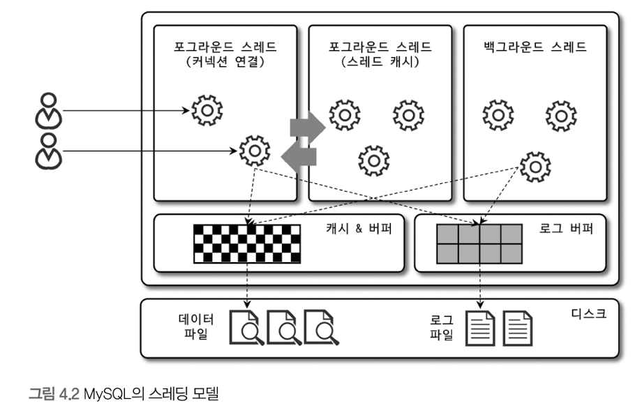
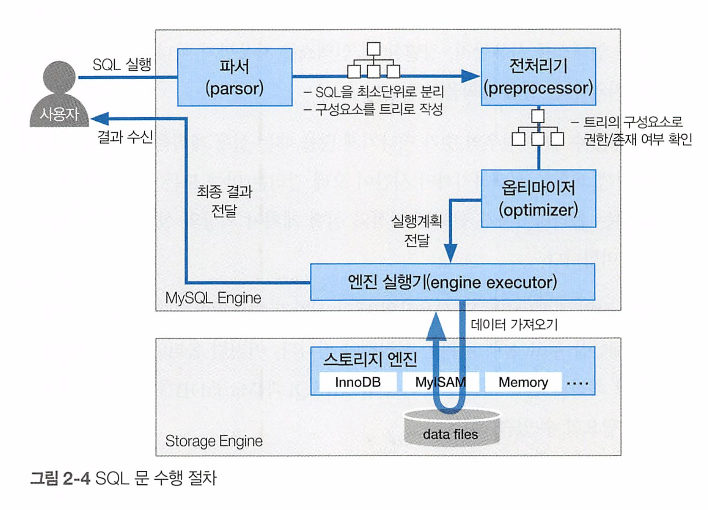
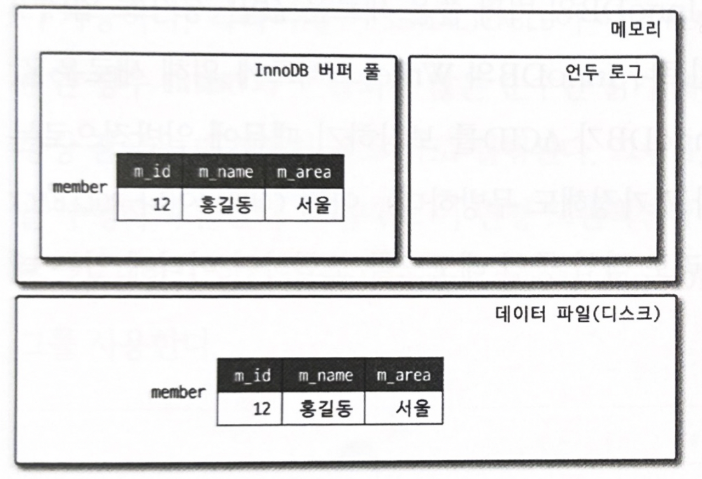
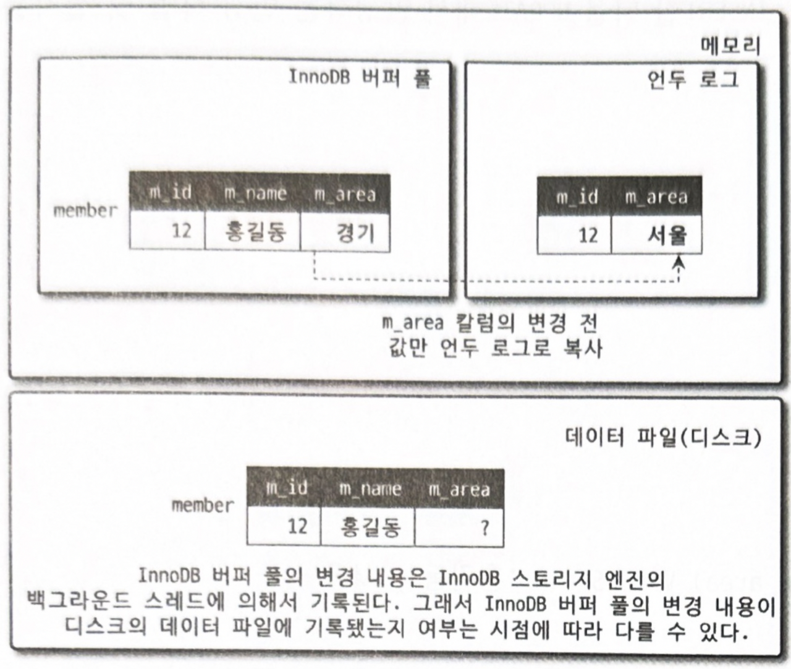
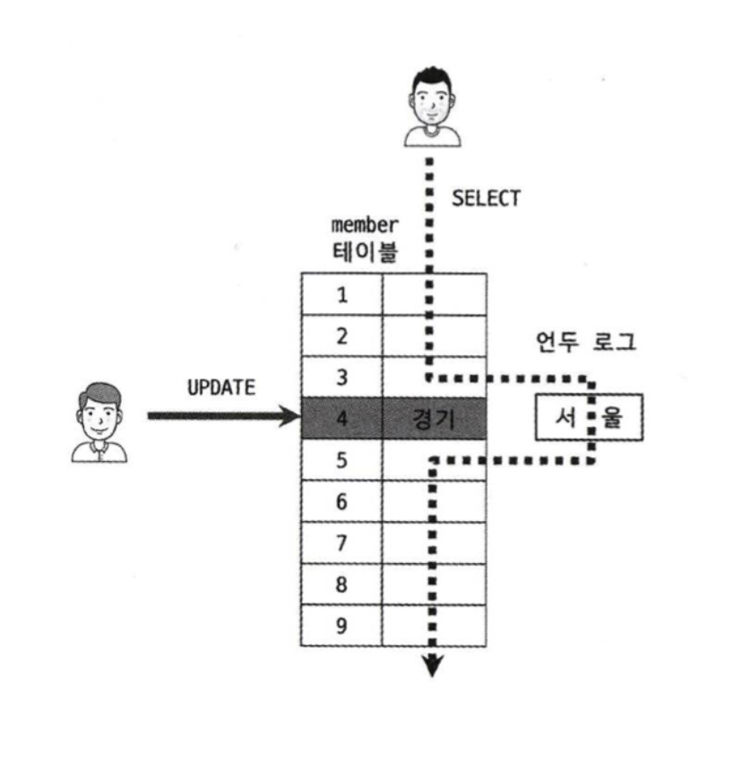
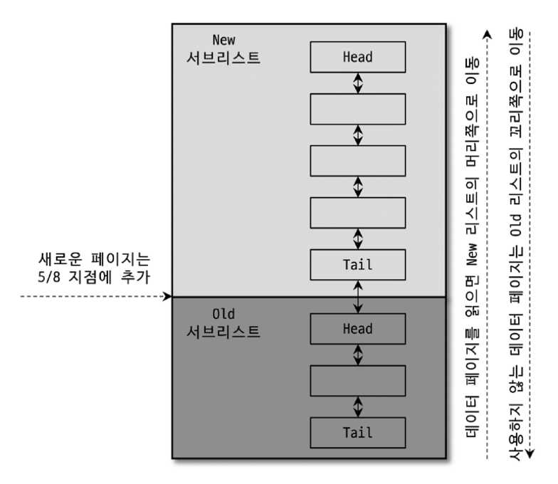
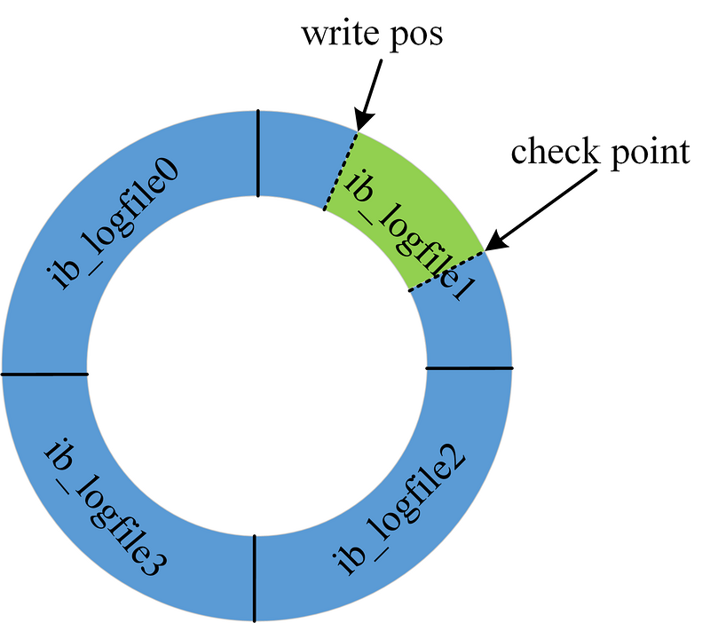
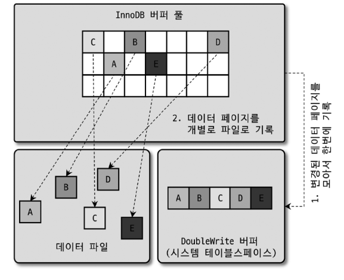
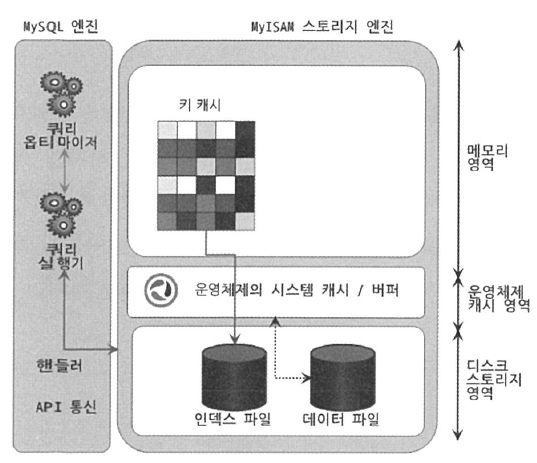

04_아키텍처 
===

## 1. MySQL 서버 구조

MySQL 서버는 크케 MySQL 엔진과 스토리지 엔진으로 구분할 수 있다.
이 둘을 합쳐 MySQL 서버라 칭한다.


---
### MySQL 엔진
MySQL 엔진은 DBMS의 두뇌에 해당한다.

구조
- 커넥션 핸들러: 클라이언트 접속, 쿼리 요청을 처리한다.
- SQL 파서: 쿼리 문장을 토큰으로 분리해 트리 형태의 구조로 만들어낸다. 이때 쿼리 문법 오류도 발견된다.
- 전처리기: 파서 트리를 기반으로 구조적 문제점 검토한다. 테이블, 컬럼, 내장 함수 개체를 매핑해 확인한다.
- 옵티마이저: 쿼리문장을 효율적으로 처리하는 것을 결정하는 중요한 역할을 한다. 
- 캐시&버퍼: 포그라운드 스레드가 데이터를 가져오는 곳.

---
### 스토리지 엔진
실제 데이터를 스토리지에 저장하거나 읽어오는 부분을 담당한다.
테이블이 사용할 스토리지 엔징을 지정하면 정의된 스토리지 엔진이 처리한다.

종류
- InnoDB 
- MyISAM 
- Memory

---
### 핸들러 API
MySQL 엔진은 파일 시스템을 다루기 위해 핸들러 API를 생성한다.

쿼리 실행기에서 데이터를 쓰고 읽을때 핸들러 API를 통해 스토리지 엔진에 요청한다.

핸들러는 MySQL 서버 밑단에서 실행 엔진의 요청에 따라 데이터를 디스크로 저장하고 읽어오는 역할을 담당한다.

실행 엔진이 각 핸들러에 요청해서 받은 결과를 또 다른 핸들러 요청의 입력으로 연결하는 역할을 수행한다.

핸들러는 결국 스토리지 엔진을 의미한다.

---
## 2. MySQL 스레딩 구조



프로세스 기반이 아닌 스레드 기반으로 동작한다.

백그라운드 스레드와 포그라운드 스레드로 구분한다.

전통적인 스레드 모델: 커넥션별 포그라운드 스레드가 생성 할당한다. (커뮤니티 에디션)

스레드풀 모델: 하나의 스레드가 여러개의 커넥션 요청을 전담한다. (엔터프라이즈 에디션)

### 포그라운드 스레드 (클라이언트 스레드)
최소 접속된 클라이언트의 수만큼 존재하며, 사용자가 요청하는 쿼리를 처리한다.

작업 종료, 커넥션 종료되면 스레트 캐시로 돌아가거나 종료한다.

데이터 버퍼나 캐시로부터 데이터를 가져오는데 없는 경우 디스크의 데이터나 인텍스 파일에서 읽어와 작업을 처리한다.

### 백그라운드 스레드
특히 로그 스레드와 쓰기 스레드를 중요 역할로 꼽는다.

쓰기 스레드는 버퍼의 데이터를 디스크로 내려 쓰는 작업을 처리한다.

읽기 작업은 지연될수 없고, 쓰기 작업은 지연 처리될 수 있다. 버퍼링해서 일괄처리 하도록 설계되었다.
(MyISAM 에서 일반 쿼리는 쓰기 버퍼링 기능 사용 불가)

---
## 3. 메모리 할당 및 사용 구조


글로벌 메모리 영역과 로컬 메모리 영역으로 구분한다.
시스템 변수로 설정 해 둔 만큼 os에서 메로리를 할당받는다.

### 글로벌 메모리 영역
하나의 메모리 공간만 할당하며, 모든 스레드에 의해 공유된다.

(테이블 캐시, InnoDB 버퍼 풀, InnoDB 어댑티브 해시 인덱스 등)

### 세션 메모리 영역
클라이언트 스레드가 사용하는 메모리 영역이다.

스레드별로 공유되지 않으면 쿼리별로 필요할 때만 할당된다.

쿼넥션이 열려있는 동안 계속 할당될 수 도 있고(커넥션 버퍼, 결과 버퍼), 
쿼리 실행 순간에 할당되었다 해제 되는 것도 있다.(소트 버퍼, 조인 버퍼)

---
## 4. 플로그인 스토리지 엔진 모델
플러그인 형태로 다양한 스토리지 엔진을 제공하고있다.

직접 개발하여 사용 가능하다.

### 단점
오직 MySQL 서버와 통신, 플러그인 끼리는 불가능 하다.
서버 변수나 함수를 직접 호출하므로 안전하지 않다.(캡슐화 안됨)
플러그인 끼리 상호 의존관계 설정 불가능하고 초기화가 어렵다.

---
## 5. 컴포넌트
플러그인의 단점을 보완해서 구현되었다.

---
## 6. 쿼리 실행 구조



---
## 7. 복제
Replication 은 매우 중요하다.
기본적인 복제 아키텍처 구조는 추후 다룬다.

---
## 8. 쿼리 캐시
쿼리캐시는 특수한 상황(읽기만하고 쓰기는 거의 없는 서비스) 말고는 그동안 많은 성능 저하와 버그의 원인이 되어왔어서 8.0 에서 제거되었다.

---
## 9. 스레드 풀
동시 요청이 많아도 스레드 풀은 사용자 요청을 처리하는 스레드 개수를 줄여 MySQL 서버의 CPU가 제한된 개수의 스레드 처리에만 집중하도록 서버 자원 소모를 줄이는 것이 목적이다.

시스템 변수를 변경해서, 스레드 그룹의 개수를 CPU 코어 수만큼 맞추는 것이 좋다.

스레드 풀 타이머 스레드는 주기적으로 스레드 그룹 상태를 체크해서 정의된 시간만큼 작업을 끝내지 못하면 새로운 스레드를생성해서 스레드 그룹에 추가한다.

엔터프라이즈 에디션은 스레드 풀은 제공, 커뮤니티 에디션은 Percona Server 의 플러그인을 설치해서 사용해야한다.

선순위 큐와 후순위 큐를 이용해 작업의 순서를 재배치할 수 있다.

---
## 10. 트랜잭션 지원 메타데이터
테이블 구조 정보와 스토어드 프토어드 프로그램 등의 정보를 데이터 딕셔너리 또는 메타데이터 하고한다.

8.0 이후부터 이 정보를 모두 InnoDB 테이블에 저장하도록 했다.

mysql DB는 mysql.ibd 라는 이름의 테이블스페이스에 저장된다. 사용자는 접근 불가하다.

---
## InnoDB 스토리지 엔진 아키텍처
가장 많이 사용되는 스토리지 엔진이다.

레코드 기반 잠금을 제공하여 높은 동시성 처리가 가능하고, 안정적이고 성능이 뛰어나다.

### 1. 프라이머리 키에 의한 클러스터링
테이블은 PK 기준으로 클러스터링되어 저장된다.
PK 키 값의 순서대로 디스크에 저장된다.

세컨더리 인덱스는 레코드 주소대신 PK 키의 값을 논리적인 주소로 사용한다.

### 2. 외래 키 지원
MyISAM, MEMORY 테이블에서는 사용할 수 없고 InnoDB 에서만 사용가능하다.

부모 테이블과 자식 테이블 모두 인덱스 생성이 필요하다. 
외래키 옵션을 끄고 작업 후 다시 활성화 하는 방법도 가능하다.

```sql
SET foreign_key_checks=OFF;
    -- 작업 실행
SET foreign_key_checks=ON;    
```
---
### 3. MVCC(Multi Version Concurrency Control)
동시 접근을 허용하는 데이터베이스에서 동시성을 제어하기 위해 사용하는 방법이다.

하나의 레코드에 여러개의 버전을 관리하는 의미로, 레코드 접근 시점의 스냅샷을 관리한다.

#### READ_COMMITTED 의 경우
InnoDB에서 기본적으로 사용하는 기본 격리 레벨이다.

read 연산 시 실제 테이블 값을 가져오지 않고, Undo 영역의 백업된 레코드에서 값을 가져온다.

트랜잭션이 시작되기 전, 완전히 커밋된 데이터만 읽는다. 언두 영역의 데이터를 읽는다.
언두 영역을 필요로하는 트랜잭션이 존재하지않을때 삭제 된다.
보통 언두 영역은 일정 크기로 유지 되므로 가장 오래된 언두 세그먼트는 제거되거나 설정에 의해 관리된다.





---
### 4. 잠금없는 일관된 읽기
엔진은 mvcc 기술을 이용해 잠금을 걸지않고 읽기 작업을 수행한다.

읽기 작업이 잠금을 기다리지 않고 가능하다.



---
### 5. 자동 데드락 감지
엔진은 내부적으로 잠금이 교착 상태에 빠지지않게 체크하는 잠금 대기 목록을 그래프 형태로 관리한다.

최종적으로 락을 얻기 위해서는 레코드에 걸려있는 모든 락이 제거되어야만 얻을 수 있다.

InnoDB는 내부적으로 데드락 감지 스레드를 가지고 있고, 트랜잭션 교착상태를 찾아 강제로 종료한다.

이때 언두 로그 양이 적은 트랜잭션을 롤백 대상으로 설정한다.

innodb_table_locks 변수를 활성화하면 테이블 락도 감지가 가능하다.

동시 처리 스레드가 많거나 하나의 트랜잭션에 락이 매우 많아지면 데드락 감지 스레드도 느려지게 된다. 
이를 해결하기 위해 innodb_deadlock_detect 변수를 제공하는데 off 설정하면 데드락 감지 스레드가 동작하지 않는다.
또는 innodb_lock_wait_timeout 변수를 활성화 하면 일정 시간 후 실패 에러 메시지를 반환하도록 한다. 일종의 ttl. 기본값은 50초.

---
### 6. 자동화된 장애 복구
기본적으로 MySQL 서버가 시작할 때 자동복구를 수행하므로, 복구 불가능한 손상이 있으면 자동 복구를 멈추고 MySQL 서버 자체를 종료한다.
innodb_force_recovery 변수를 통해 재시작 후 mysqldump를 통해 가능한 데이터를 백업하고 서버와 DB를 재생성해야한다.
innodb_force_recovery 가 0이 아닌 복구 모드에서는 SELECT 이외의 쿼리는 수행 할 수 없다.


| innodb_force_recovery 값 | 복구 전략 모드                      | 설명                                                                                                                                                                                                                                                                   |
|:-----------------------:|-----------------------|----------------------------------------------------------------------------------------------------------------------------------------------------------------------------------------------------------------------------------------------------------------------|
|            1            | SRV_FORCE_IGNORE_CORRUPT | 테이블스페이스의 데이터나 인덱스 페이지에서 손상된 부분이 발견되어도 무시하고 서버를 시작한다. 이때 덤프해서 데이터베이스를 다시 구축하는게 좋다.                                                                                                                                                                                    |
|2|SRV_FORCE_NO_BACKGROUND| 백그라운드 스레드 중 메인 스레드를 시작하지 않고 서버를 시작한다. 이는 메인 스레드가 undo 영역을 주기적으로 비울 때 장애가 발생했을때 이 모드로 복구한다.                                                                                                                                                                           |
|3|SRV_FORCE_NO_TRX_UNDO| 커밋되지 않고 종료된 트랜잭션은 그대로 남아있도록 서버를 시작한다. innoDB에서는 트랜잭션 실행 시 롤백에 대비하여 변경 전의 데이터를 undo 영역에 기록하고, 서버 재시작 시 undo 영역의 데이터를 우선적으로 데이터 파일에 적용하는데 보통 커밋되지 않은 데이터는 롤백을 한다. 이때 롤백을 하지 않고 재시작을 하는 전략이다.                                                                           |
|4|SRV_FORCE_NO_IBUF_MERGE| 인서트 버퍼의 내용을 무시하고 강제로 시작한다. 데이터 변경으로 인한 인덱스 변경 작업을 바로 처리하거나, 인서트 버퍼에 저장해두고 나중에 데이터 파일에 병합하는데, 만약 인서트 버퍼가 손상되었다면 사용하는 전략이다. 인서트 버퍼는 인덱스와 관련된 부분이므로 테이블 덤프한 후 데이터베이스를 구축하면 데이터 손실없이 복구할 수 있다.                                                                           |
|5|SRV_FORCE_NO_UNDO_LOG_SCAN| 언두 로그를 모두 무시하고 시작한다. innoDB에서는 재시작 시 언두 영역에 있는 데이터를 이용하여 복구하고, 리두 로그를 활용하여 종료 시점이나 장애 시점의 상태를 재현하며, 커밋되지 않은 트랜잭션에서 변경한 작업은 모두 롤백 처리되는데, 이러한 언두 로그가 손상되었을 때 사용하는 전략이다. 주의할점은 이 전략을 사용하면 커밋되지 않은 작업도 모두 커밋된 것처럼 처리된다. 이때도 mysqldump를 이용해 데이터를 백업하고 데이터베이스를 새로 구축해야 한다. |
|6|SRV_FORCE_NO_LOG_REDO| 리두 로그를 모두 무시하고 시작하는 모드이다. 커밋되었거나 리두 로그에만 기록되고 데이터 파일에 기록되지 않은 데이터는 모두 무시되며, 마지막 체크포인트 시점에서의 데이터만 남게 된다. InnoDB의 리두 로그가 손상되면 서버를 시작하지 못한다. 손상된 리두 로그를 삭제하고 서버를 시작하면 리두 로그를 새로 만든다. 이때도 mysqldump를 이용해 데이터를 백업하고 데이터베이스를 새로 구축해야 하는게 좋다.                               |

---
### 7. InnoDB 버퍼 풀
InnoDB 스토리지 엔진에서 가장 핵심적인 부분이다. 디스크의 데이터 파일이나 인덱스 정보를 메모리에 캐시해 두는 공간이다.

쓰기 작업을 지연시켜 일괄 작업으로 처리할 수 있게 해주는 버퍼 역할도 같이 한다.

버퍼풀이 랜덤한 레코드 변경 데이터를 모아 처리해 디스크 작업의 횟수를 줄인다.

** 버퍼풀 크기 설정

운영 체제와 각 클라이언트 스레드가 사용할 메모리도 충분히 고려해서 설정해야 한다.

레코드 버퍼(각 클라이언트 세션에서 테이블 레코드를 읽고 쓸때 버퍼로 사용하는 공간)가 상당한 메모리를 사용하며, 이는 전체 커넥션 개수와 읽고 쓰는 테이블 개수에 따라 결정된다.

버퍼풀 크기를 동적으로 조절할 수 있으며, 전체 메모리 공간이 8GB 미만이라면 50% 정도만 InnoDB 버퍼 풀로 설정하고 나머지 메모리 공간은 MySQL 서버 및 다른 프로그램이 사용할 수 있게 확보해놓는다.

전체 메모리 공간이 그 이상이라면 50% 에서 시작해 최적점을 찾는다.
50GB 이상은 15-30GB 정도를 남겨두고 나머지를 버퍼풀로 할당하자.
공식 문서에서는 최대 80% 할당한다고 한다.

** 버퍼풀 구조 (LRU 리스트, Flush 리스트, Free 리스트)

InnoDB는 버퍼풀이하는 거대한 메모리 공간을 페이지 크기 조각으로 쪼개 필요할 때 데이터 페이지를 읽어 각 조각에 저장한다.
버퍼풀의 페이지 크기 조각을 관리하기 위해 3개의 자료구조를 관리한다.

- Free 리스트<br>
실제 사용자 데이터로 채워지지 않은 비어있는 페이지들의 목록이다.


- LRU 리스트<br>
LRU(Least Recently Used)와 MRU(Most Recently Used) 리스트가 결한된 형태이다.
목적은 디스크로부터 한번 읽어온 페이지를 최대한 오랫동안 버퍼풀의 메모리에 유지해서 읽기를 최소화 하는 것이다.
New 서브리스트는 MRU 리스트, Old 서브리스트가 LRU 리스트이다.
버퍼풀에서 자주 사용되는 페이지는 상위로 이동되고, 자주 쓰이지 않는 데이터는 하위로 이동한다.


** InnoDB 에서 데이터를 찾는 과정
1. 필요한 레코드가 저장된 페이지가 버퍼풀에 존재하는지 검사한다.
2. 디스크에서 필요한 데이터 페이지를 버퍼 풀에 적재하고, 적재된 페이지에 대한 포인터를 LRU 헤더 부분에 추가한다.
3. 버퍼풀에 LRU 헤더 부분에 적재된 데이터가 실제로 읽히면 New 서브리스트 헤더 부분으로 이동한다.
4. 버퍼 풀에 상주하는 페이지는 사용자 접근량에 따라 Age를 부여받고 쿼리에서 오래 사용되지 않는다면 버퍼풀에서 제거된다
5. 필요한 데이터가 자주 접근되는 데이터라면, 해당 페이지의 인덱스 키를 어댑티브 해시 인덱스에 추가한다.

- Flush 리스트<br>
디스크로 동기화되지 않은 데이터를 가진 데이터 페이지의 변경시점 기준의 페이지 목록을 관리한다.
지연 쓰기로 인해 쿼리 실행하여 발생한 변경사항이 즉시 디스크에 반영되지 않는것을 관리하기 위함이다.

** 버퍼풀과 리두로그

버퍼풀에는 변경사항이 디스크에 반영되지 않은 더티 페이지를 가지고 있다.
디스크 반영을 위해 리두 로그를 이용하여 버퍼풀에 머무르지 않도록 관리한다.


리두 로그는 로그파일을 원형으로 구성하여 사용한다. 반영되어야 하는 내용들이 쌓이고, write pos 와 check point 가 만나면 다른 작업을 멈추고, 디스크에 내용들을 동기화 한다.

** 버퍼풀 플러시 Buffer Pool Flush

InnoDB는 더티 페이지들을 2개의 Flush 기능을 백드라운드로 실행해 디스크에 동기화한다.
1. 플러시 리스트 플러시
   버퍼풀의 플러시 리스트를 디스크로 동기화 한다.

2. LRU 리스트 플러시
   사용빈도가 낮은 데이터 페이지들을 디스크로 동기화하고 풀에서 제거한다.

---
### 8. Double Write Buffer

버퍼풀의 더티 페이지를 디스크 파일로 플러시할 때 일부만 기록되는 Partial-page, Torn-page 문제가 발생할 수 이다.
이런 문제를 해결하기 위해 Double-Write 기법을 이용한다.



각 페이지는 디스크에 랜덤하게 위치해 있기 때문에 변경작업을 하기 위해 각 페이지 위치를 찾아가야한다.
따라서 디스크에 위치한 double write buffer에 한번의 디스크 I/O로 연속적으로 해당 내용들을 저장한다.
그리고 실제 위치에 각 페이지들을 저장한다.

---
### 9. 언두 로그 Undo Log
트랜젝션과 격리 수준을 보장하기 위해 변경 이전 데이터를 백업한다. 
이렇게 백업한 데이터를 언두 로그 라고 한다.

언두 로그가 저장되는 공간을 언두 테이블 스페이스라고 한다.
언두 테이블 스페이스는 1개 이상 128개 이하의 롤백 세그먼트를 가지며, 롤백 세그먼트는 1개 이상의 언두 슬롯을 가진다.
일반적으로 트랜잭션이 대략 2개의 언두 슬롯을 필요로 한다고 가정하면 된다.

- 트랜잭션 보장<br>
트랜잭션 롤백이 발생하면, 복구를 위한 변경 이전의 데이터로 돌리기 위한 데이터를 제공한다.
- 격리수준 보장<br>
특정 데이터를 변경하는 도중 다른 커넥션에서 데이터를 조회하면 트랜잭션 격리수준에 맞게 언두 로그에 백업해둔 데이터를 읽어서 반환한다.

---
### 10. 체인지 버퍼 Change Buffer
RDBMS 레코드가 변경되면 데이터 뿐만이 아니라 해당 테이블에 포함된 인덱스를 업데이트 하는 작업도 필요하다.
이 작업은 많은 자원을 소모하게 되는데, 이를 즉시 실행하지 않고 임시 공간에 저장해두고 바로 사용자에게 결과를 반환하는 형태로 성을을 향상시켰다.
이때 사용하는 임시 메모리 공간을 체인지 버퍼 하고 한다.

반드시 중복 여부를 체크해야하는 유니크 인덱스는 체인지 버퍼를 사용할 수 없다.
체인지 버퍼에 임시로 저장된 인덱스 레코드 조각은 백그라운드 스레드에 의해 병합되는데 이 스레드를 체인지 버퍼 머지 스레드 하고 한다.

---
### 11. 리두 로그 및 로그 버퍼
디스크 영역에 있는 기록할 데이터인 리두 로그는 트랜잭션 영속성과 가장 밀접하게 연된되어 있다.
서버가 비정상 종료시 아직 기록되지않은 리두 로그의 데이터를 가져와 복구 가능하다.

리두로그는 트랜잭션이 커밋되면 즉시 디스크로 기록 되도록 설정하는것을 권장한다.
그래야 서버 비정상 종료시 직전까지의 트랜잭션 커밋 내용이 리두 로그에 기록될 수 있고, 그것을 이용해 장애 직전 시점까지의 복구가 가능하다

리두로그 버퍼링에 사용되는 공간이 로그 버퍼다. 리두 로그에 기록할 데이터를 보관하는 메모리 영역이다.
로그 버퍼의 데이터는 주기적으로 디스크로 플러시 된다.

**Redo Log 동작 순서**
1. 버퍼 풀에서 데이터가 변경되면 해당되는 페이지를 수정한 다음 Dirty 마킹을 진행
2. 관련된 리두 로그 레코드를 Double Write Buffer에 저장
3. 리두 로그 레코드를 로그 버퍼로 이동
4. 리두 로그 레코드를 리두 로그 파일로 플러시
5. 변경된 Dirty 페이지에 대해 체크포인트를 수행하여 System tablespace에 저장

_중요한 점은 바로 디스크 영역인 System tablespace에 저장하는 게 아니라 로그 버퍼에 들어가고, 한 번에 모아서 리두 로그 파일로 플러시하는 것이다._

---
### 12. 어댑티브 해시 인덱스 Adaptive Hash Index
사용자가 자주 요청하는 데이터에 대해서 자동으로 생성하는 인덱스다.
어댑티브 해시 인덱스는 B-Tree 루트노드부터 리프노드까지 찾아가는 검색시간을 줄여주기 위해 도입된 기능이다.
자주 읽히는 데이터 페이지의 키 값을 이용해 해시 인덱스를 만들어 해당 인덱스 기준으로 데이터 페이지를 바로 찾아간다.

해시 인덱스의 경우 인덱스 키 값과 인덱스 키 값이 저장된 데이터 페이지 주소의 쌍으로 관리되며,
인덱스 키 값은 B-Tree 인덱스의 고유 번호와 실제 키 값으로 이루어져 있다.
B-Tree의 고유 번호를 사용해 하나만 존재하도록 만든다.
모든 B-Tree 인덱스에 대한 어댑티브 해시 인덱스가 하나의 해시 인덱스에 저장되며, 특정 키 값이 어느 인덱스에 속한 것인지도 구분한다.

버퍼 풀에 로딩된 페이지 주소를 사용하기 때문에 버퍼 풀에 올라간 데이터에 대해서만 관리된다.
버퍼 풀에서 삭제되면 인덱스 정보 역시 함께 제거된다.

---
### 13. InnoDB와 MyISAM, Memory 스토리지 엔진 비교
예전까지 MyISAM을 기본으로 쓰는 경우가 많았으나 8.0 버전 이후 InnoDB 스토리지 엔진의 기능 개선으로 대부분 대체되는 듯 하다.
트랜잭션 처리가 중요한 목적으로 사용되고 뛰어난 동시 처리 성능도 가지므로 InnoDB가 다른 스토리지 엔진보다 우위를 점한다. 

---
## MyISAM 스토리지 엔진 아키텍처
MyISAM 스토리지 엔진의 성능에 영향을 미치는 요소인 키 캐시와 운영체제의 캐시/버퍼




### 1. 키 캐시
InnoDB 버퍼풀과 비슷한 역할을 하는것이 키캐시다.
인덱스만을 대상으로 작동하며, 인덱스의 디스크 쓰기 작업에 대해서만 부분적으로 버퍼링 역할을 한다.

> 키 캐시 히트율(hit rate) = 100 - (Key_reads / Key_read_requests*100)

Key_reads: 인덱스를 디스크에서 읽어들인 횟수
Key_read_requests: 키캐시로부터 인덱스를 읽은 횟수

메뉴얼에서 기캐시를 이용한 쿼리의 비율을 99% 이상으로 유지하라고 권장한다.

### 2. 운영체제의 캐시 및 버퍼
MyISAM 테이블의 인덱스는 키캐시를 이용해 디스크를 검색하지 않고도 빠르게 검색할 수 있다.
하지만 테이블 데이터(row)에 대해서는 캐시나 버퍼링 기능이 없으므로 읽기나 쓰기 작업은 항상 디스크 읽기 쓰기 작업 요청을 한다.

운영체제의 캐시 기능을 사용하지만 운영체제의 캐시공간은 남는 메모리를 사용하므로, <br>
다른 애플리케이션에서 메모리를 모두 사용한다면 캐시가 불가능하여 쿼리가 느려진다. 
따라서 MyISAM 성능은 OS 기능 의존성이 높으며, 충분한 메모리 확보가 필요하다. 
(참조: MyISAM 스토리지 엔진 구조)

### 3. 데이터 파일과 프라이머리 키(인덱스) 구조
InnoDB 는 프라이머리 키에 의한 클러스터링되고,<br>
MyISAM 테이블은 클러스터링 없이 데이터 파일이 Heap 공간처럼 활용된다. INSERT 순서대로 데이터 파일에 저장된다.

ROWID 2가지 방식으로 저장
- 고정길이: 테이블을 생성할 때 MAX_ROWS 옵션 활성화 사용한다. 최대로 가질 수 있는 레코드가 한정된 페이블을 생성한다.
이떄 INSERT 된 순번이 ROWID로 사용된다.
- 가변길이: 그외. 2 ~ 7byte 를 갖고 첫번째 바이트는 길이정보를 저장한다.
첫번째 바이트는 ROWID 길이를 저장하는 용도, 나머지는 실제 ROWID를 저장한다.

---
## MySQL 로그파일

로그파일을 이용하면 MySQL 상태나 부하를 일으키는 원인을 찾아 해결할 수 있어 유용하다.

---
### 1. 에러 로그 파일
실행 도중 발행하는 에러 경고메시지가 출력되는 로그 파일이다.
my.cnf 의 log_error 에 정의되어있는 경로에 생성된다.

**메시지 유형**
- 설정파일 변경, 비정상 종료 후 재시작인 경우 정보성 에러 메시지
- 비정상 종료 후 나타나는 트랜잭션 복구 메시지
- 쿼리 처리 도중 발생하는 문제
- 비정상적으로 종료된 커넥션 메시지
- 모니터링 또는 상태 조회 명령의 결과 메시지
- MySQL 의 종료 메시지

---
### 2. 제너럴 쿼리 로그 파일(제너럴 로그 파일, General log)
쿼리 로그를 활성화 해 실행되는 쿼리들의 목록을 확인 가능하다.
general_log_file 로 제너럴 로그 파일 경로 설정한다.
실행되기 전에 MySQL 이 쿼리 요청을 받으면 바로 기록하고 실행중 에러가 발생해도 일단 로그파일에 기록한다.

---
### 3. 슬로우 쿼리 로그
서비스에서 사용되는 쿼리 중 어떤 쿼리가 문제인지 판단하는데 슬로우 쿼리 로그가 유용하다.

long_query_time 에 설정한 시간 이상이 소요된 쿼리가 모두 기록된다.
반드시 정상적으로 실행이 완료되어야 슬로우 쿼리 로그에 기록된다.

log_output 옵션으로 테이블 또는 파일의 저장 형식을 정할 수 있다.

```
# Time:2020-07-19T15:44:22.178484+09:00
# User@Host:root[root] @ localhost [] Id: 14
# Query_time:1.180245 Lock_time:0.002658 Rows_sent:1 Rows_examined:2844047
use employees;
SET timestamp=1595141060;
select emp_no, max(salary) from salaries;
```

Time: 쿼리가 종료된 시점.<br>
User@Host:  쿼리를 실행한 사용자의 계정<br>
Query_time: 쿼리가 실행되는데 걸린 전체시간<br>
Rows_examined: 쿼리가 처리되기 위해 몇건의 레코드에 접근했는지<br>
Rows_sent: 실제 몇건의 처리결과를 클라이언트로 보냈는지

쿼리 로그 파일의 내용이 많아 파악이 어려운 경우 
Percona Toolkit 의 pt-query-digest 스크립트를 이용해 쿼리를 정렬해서 볼수 있다.

