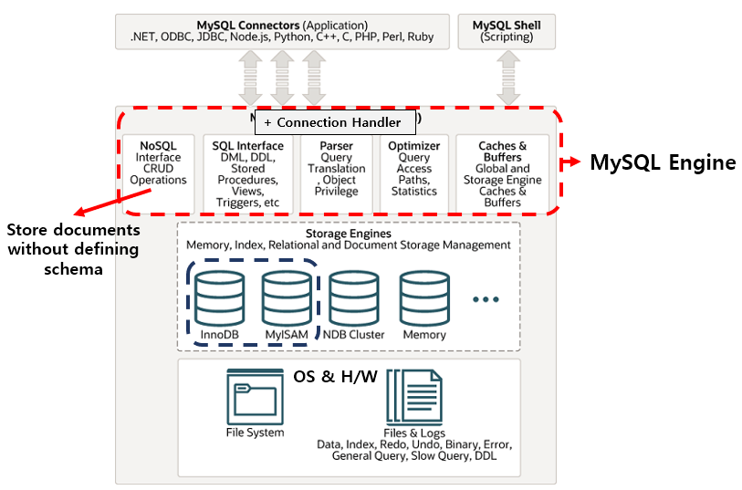
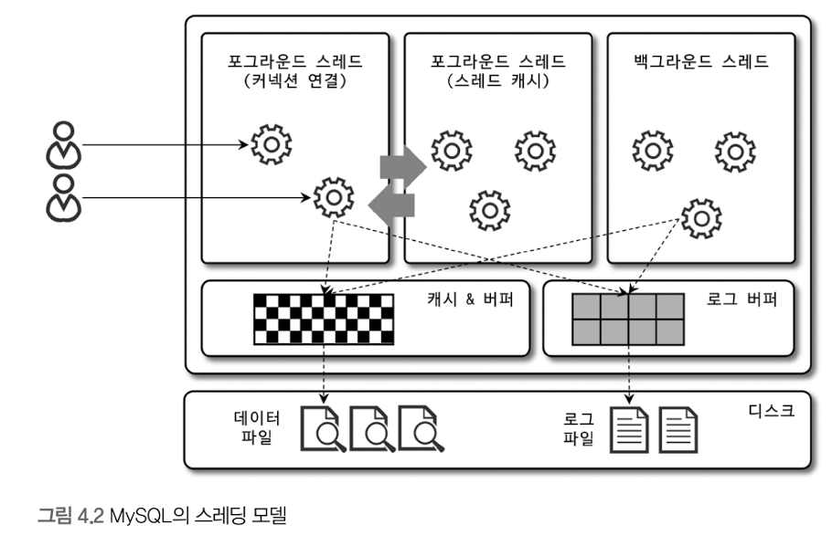
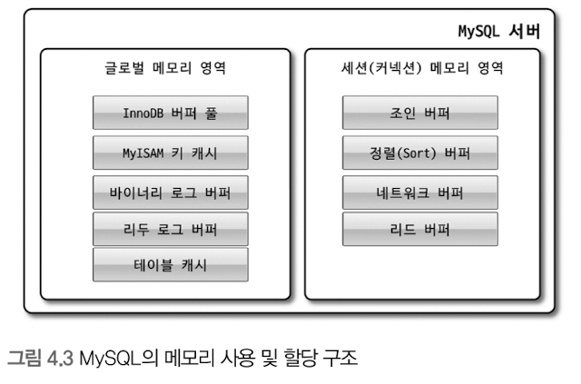
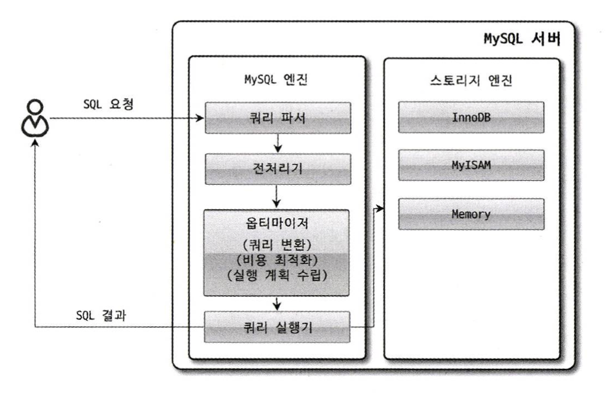

# [Chapter 4] Architecture
```text
MySQL Server = MySQL Engine + Storage Engine
MySQL Engine ≒ HEAD, Storage Engine ≒ HAND
```
# Architecture of MySQL Engine
## 1. Full Architecture of MySQL
<sup>[1]</sup>
- MySQL은 대부분의 프로그래밍 언어로부터 접근 방법 지원 ex) 자체 C API, JDBC 등
- 또는, 모든 언어로 MySQL 서버에서 query 사용 가능
### MySQL Engine
```text
MySQL 서버 내에 1개만 존재하며, 접속/쿼리 처리를 위한 엔진
```
1. **Connection Handler : 접속 + 쿼리 요청 처리**
2. SQL Parser
3. Pre-processor
4. **Optimizer : 쿼리의 최적화된 실행을 위함**

### Storage Engine
```text
실 데이터 저장 및 읽기를 위한 엔진
```
- MySQL 엔진과 다르게 **여러 대**를 동시에 둘 수 있음
- 성능 향상을 위해 각기 다른 특징을 가짐
  - ex) Key cache(MyISAM), Buffer pool(InnoDB), Fast & Volatile(Memory)
- 아래와 같이 테이블 생성 시, Storage 엔진을 지정하면 해당 테이블의 연산은 지정된 엔진이 처리
    ```
    CREATE TABLE table(id INT, status INT) ENGINE=INNODB;
    ```

### Handler API
```text
SQL Query 실행기 ---(읽기/쓰기 요청)---> InnoDB/MyISAM/...
  MySQL Engine        Handler API        Storage Engine
```
- Handler request : MySQL 엔진의 쿼리 실행기에서 Storage 엔진에 읽기/쓰기 요청하는 것
- Handler API를 통해서만 Handler request를 두 엔진 간에서 주고 받음
  - Storage 엔진은 Handler API를 구현하여 요청 처리<sup>[2]</sup>
- 핸들러 API를 통한 레코드 작업 확인 SQL
    ```sql
    SHOW GLOBAL STATUS LIKE 'Handler%';
    ```
**MySQL에서의 Handler란..**
- 어떤 기능을 호출하기 위한 객체를 칭함

## 2. Structure of MySQL Threading
```text
MySQL Server is based on THREAD, not process.
Foreground Thread + Background Thread
```


### Check Thread
- 실행 중인 thread의 목록은 performance_schema DB의 threads 테이블 참조
- select 문으로 위의 테이블을 조회 시, thread/sql/one_connection name을 갖는 스레드가 실 사용자의 요청을 처리하는 Foreground thread.

### Foreground Thread(=Client Thread)
- MySQL 서버에 접속된 client의 수 이상만큼 존재
- client가 요청하는 query 처리
- client가 connection 종료 시 담당 thread는 thread cache로 돌아감
  - thread cache에 일정 개수(=thread_cache_size) 이상의 thread가 있으면 종료시켜서 thread cache의 크기 유지
- **데이터를 Buffer or Cache에서 가져옴**

### Background Thread
- **InnoDB가 background thread로 처리하는 작업들**
  1. Insert Buffer를 병합
  2. Log Thread : <U>**Log를 디스크에 기록**</U>
  3. Write Thread : <U>**InnoDB Buffer pool을 디스크에 기록**</U>
  4. 데이터를 Buffer로 read
  5. Lock or Deadlock 모니터링
- 특히, 3번의 쓰기 thread는 매우 많은 작업을 background thread로 처리
- 쓰기 작업은 buffering 하여 일괄 처리 가능, 읽기 작업은 buffering **절대 불가능**
  - InnoDB가 이런 방식으로 처리
  - **MyISAM은 client thread(=foreground)가 쓰기 작업까지 함께 처리 : <U>쓰기 buffering 기능 없음</U>**

## 3. Memory Allocation & Structure of Usage
```text
MySQL Memory = Global Memory Area + Local Memory Area
```


### Global Memory Area
- MySQL 서버 시작 시 OS로부터 할당 받음
  - MySQL 시스템 변수로 설정한 만큼 할당 받음
- Client thread의 개수와 무관하게 할당, 통상적으로 하나만 할당됨
- 모든 thread에 공유되는 영역

### Local Memory Area(=Session / Client Memory Area)
- Client thread가 query 처리 시 사용
  - 각 client thread에 독립적으로 할당, **절대 공유 X**
- 각 query의 용도별로 필요 시에만 공간 할당
  - 필요 없는 경우 공간 할당 X (ex: Sort buffer, Join buffer)
- Connection이 열린 동안 계속 할당 : Connection buffer, Result buffer
- Query 실행 시 할당, 후에 해제 : Sort buffer, Join buffer

## 4. Plugin Storage Engine Model
```text
MySQL의 구성 요소를 custom하게 개발해서 끼워 맞출 수 있음
ex) Storage Engine, 검색어 Parser, User Authentication ...
```

### Disadvantages
1. Plugin 간의 통신 불가능 : MySQL 서버와만 인터페이스 가능
2. MySQL 서버의 변수, 함수 직접 호출 : 안전하지 않음(No Capsulation)
3. 어려운 초기화 : 상호 의존 관계 설정 불가

## 5. Component
- Plugin의 단점을 보완하고자 추가
  - Logical component의 구성으로 MySQL Server의 Encapsulation을 목표로 함<sup>[3]</sup>
  - 다른 component를 이용할 수 있는 API, service 등으로 구성될 수 있음
  - component를 overriding 하여 보완도 가능

## 6. Process of Query Executing


### Query Parser
- Query를 token 단위로 분리하여 tree로 구조화
  - token : MySQL이 인식할 수 있는 최소 단위의 어휘/기호
- Query의 syntax error는 여기서 발견됨

### Pre-processor
- Parser tree를 기반으로 token을 테이블, 칼럼 명, 함수와 같은 객체로 매핑
- 객체의 존재 여부와 접근 권한 확인 : 존재하지 않거나 권한이 없는 객체는 여기서 걸러짐

### Optimizer
- Query를 저렴한 비용으로 가장 빠르게 처리하는 방법 결정
- DBMS의 두뇌와 유사한 개념

### Execution Engine
- 만들어진 계획(from Optimizer)대로 각 handler에게 요청하여 얻은 결과를 또 다른 handler의 요청으로 연결

### Handler(Storage Engine)
- MySQL 서버의 가장 밑단에서 데이터를 디스크로 저장 or 디스크로 데이터를 읽어오는 역할
- 핸들러는 곧 Storage Engine을 의미하게 됨

## 7. Replication
- 1개 이상의 레플리카(replica) 저장소가 소스 저장소와 동기화를 자동으로 유지하는 과정<sup>[4]</sup>

### 장점
1. Scale Out : 읽기 작업은 replica에서 가능
2. Protection of Data
3. Analyzing : 원본 데이터에 이슈 없이 replica에서 분석 작업 가능
4. Distant Data Distribution : 원격 사이트에서 사용할 데이터 복제

## 8. Query Cache
```text
MySQL 8.0 기준 완전히 사라진 기능
```
- SQL 실행 결과를 메모리에 캐싱하여 동일한 SQL 요청이 들어오면 캐싱된 결과 즉시 반환
- 하지만, 테이블 변경 시 관련된 정보는 모두 삭제 -> 성능 저하

## 9. Thread Pool
- 사용자의 요청을 처리하는 thread 개수 줄임
  - 제한된 개수의 thread 처리 집중 -> 자원 소모 줄이기
- Enterprise edition에서만 제공
  - Percona Server라는 Plugin에서도 thread pool을 제공

### Operating thread pool from Percona Server
- CPU 코어의 개수(default) or thread_pool_size 시스템 변수의 값 만큼 thread group 생성
- MySQL 서버가 처리할 요청을 thread pool로 이관
  - 이미 thread pool이 처리 중인 작업이 있는 경우 별도의 시스템 변수만큼 추가로 더 받아줌
- 모든 스레드가 일을 처리 시에는 thread pool 내의 timer thread가 thread group 상태 체크
  - 작업 thread가 지금 처리 중인 작업을 시스템 변수에 정의된 시간 이상 끝내지 못하면 새로운 thread 생성 후 group에 추가
  - 그럼에도 무한정으로 thread를 생성할 수는 없고, 전체 thread 개수도 시스템 변수에 설정된 개수를 넘길 수 없음
- 선순위 큐와 후순위 큐를 이용하여 특정 작업 우선 처리 가능

## 10. Transaction Support Metadata
```text
Metadata(=Data Dictionary) : Table Schema & Stored Program
```
- 8.0부터 metadata, system table은 InnoDB 테이블에 저장 : mysql DB에 저장함
  - 트랜잭션 지원 및 일관된 상태로 저장됨
  - 데이터 디렉토리에 mysql.idb 파일으로 저장되어 있음 
- InnoDB 이외의 Storage 엔진 사용 시에는 SDI(Serialized Dictionary Information) 사용
  - *.sdi 파일로 저장, 직렬화를 위한 포맷

# InnoDB Storage Engine Architecture
## 1. Clustering by Primary Key
## 2. Supporting Foreign Key
## 3. MVCC(Multi Version Concurrency Control)
## 4. Non-Locking Consistent Read
## 5. Automatic Detection of Deadlock
## 6. Automatic Fault Recovery
## 7. InnoDB Buffer Pool
### Configuring Size of Buffer Pool
### Structure of Buffer Pool
### Buffer Pool & Redo Log
### Buffer Pool Flush
### Back up & Restoration of Buffer Pool's Status
### Check Buffer Pool's stored content
## 8. Double Write Buffer
## 9. Undo Log
### Monitoring of Undo Log
### Management of Undo Table Space
## 10. Change Buffer
## 11. Redo Log & Log Buffer
### Archiving for Redo Log
### Activation & De-activation of Redo Log
## 12. Adaptive Hash Index
## 13. Comparison between InnoDB, MyISAM and Memory

# MyISAM Storage Engine Architecture
## 1. Key Cache
## 2. Cache & Buffer of OS
## 3. Data files & Structure of Primary Key(Index)

# MySQL Log File
## 1. Error Log File
## 2. General Query Log File
## 3. Slow Query Log

## References
[1] https://www.mysql.com/products/enterprise/document_store.html#:~:text=MySQL%20Document%20store%20gives%20users,schema%2Dfree%20document%20database%20applications.
[2] https://velog.io/@j_6367/MYSQL.-Handler-API%EC%99%80-Status
[3] https://dev.mysql.com/doc/dev/mysql-server/latest/PAGE_COMPONENTS.html
[4] https://escapefromcoding.tistory.com/710
[picture] https://letsmakemyselfprogrammer.tistory.com/62