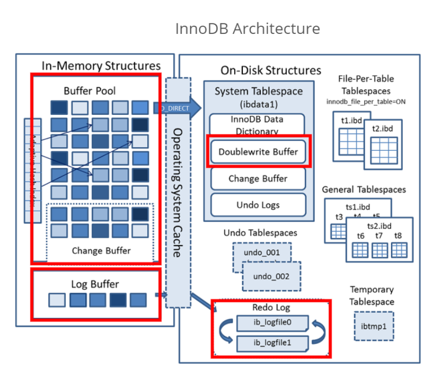
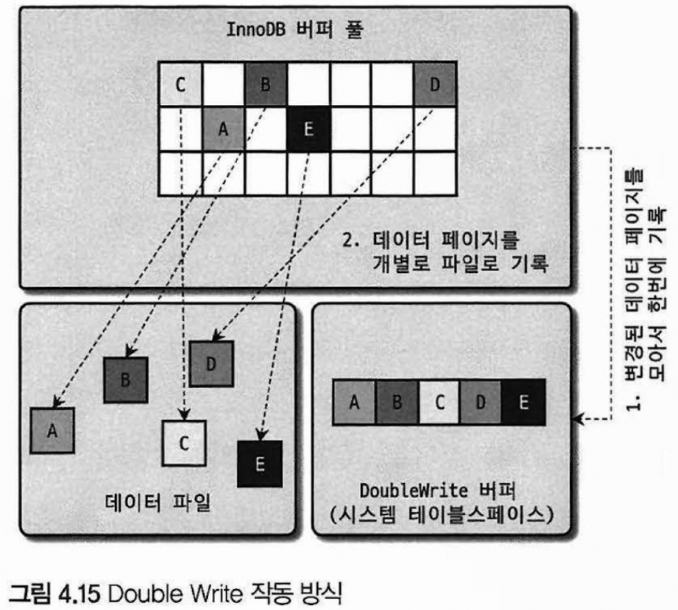
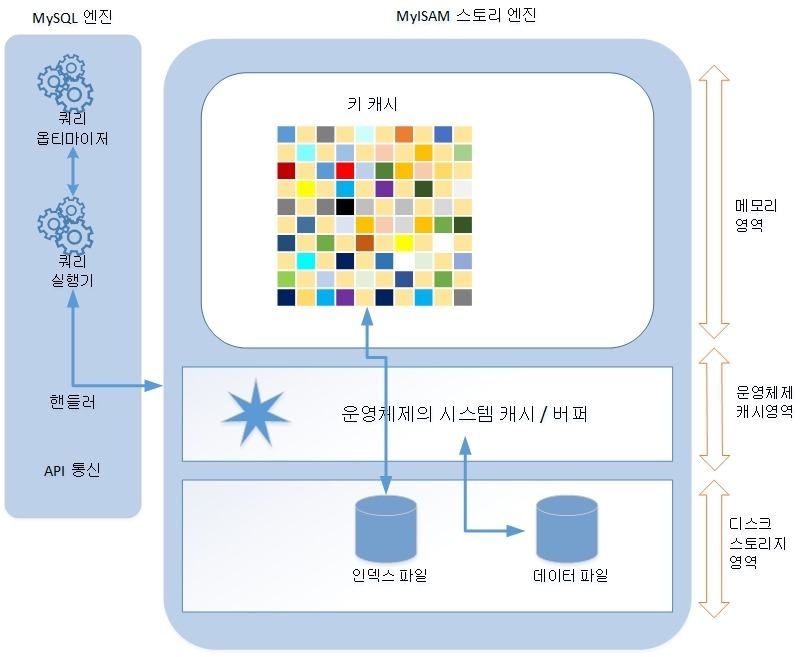

# [Chapter 4] Architecture
```text
MySQL Server = MySQL Engine + Storage Engine
MySQL Engine ≒ HEAD, Storage Engine ≒ HAND
```
# Architecture of MySQL Engine
## 1. Full Architecture of MySQL
<sup>[1]</sup>
- MySQL은 대부분의 프로그래밍 언어로부터 접근 방법 지원 ex) 자체 C API, JDBC 등
- 또는, 모든 언어로 MySQL 서버에서 query 사용 가능
### MySQL Engine
```text
MySQL 서버 내에 1개만 존재하며, 접속/쿼리 처리를 위한 엔진
```
1. **Connection Handler : 접속 + 쿼리 요청 처리**
2. SQL Parser
3. Pre-processor
4. **Optimizer : 쿼리의 최적화된 실행을 위함**

### Storage Engine
```text
실 데이터 저장 및 읽기를 위한 엔진
```
- MySQL 엔진과 다르게 **여러 대**를 동시에 둘 수 있음
- 성능 향상을 위해 각기 다른 특징을 가짐
  - ex) Key cache(MyISAM), Buffer pool(InnoDB), Fast & Volatile(Memory)
- 아래와 같이 테이블 생성 시, Storage 엔진을 지정하면 해당 테이블의 연산은 지정된 엔진이 처리
    ```
    CREATE TABLE table(id INT, status INT) ENGINE=INNODB;
    ```

### Handler API
```text
SQL Query 실행기 ---(읽기/쓰기 요청)---> InnoDB/MyISAM/...
  MySQL Engine        Handler API        Storage Engine
```
- Handler request : MySQL 엔진의 쿼리 실행기에서 Storage 엔진에 읽기/쓰기 요청하는 것
- Handler API를 통해서만 Handler request를 두 엔진 간에서 주고 받음
  - Storage 엔진은 Handler API를 구현하여 요청 처리<sup>[2]</sup>
- 핸들러 API를 통한 레코드 작업 확인 SQL
    ```sql
    SHOW GLOBAL STATUS LIKE 'Handler%';
    ```
**MySQL에서의 Handler란..**
- 어떤 기능을 호출하기 위한 객체를 칭함

## 2. Structure of MySQL Threading
```text
MySQL Server is based on THREAD, not process.
Foreground Thread + Background Thread
```


### Check Thread
- 실행 중인 thread의 목록은 performance_schema DB의 threads 테이블 참조
- select 문으로 위의 테이블을 조회 시, thread/sql/one_connection name을 갖는 스레드가 실 사용자의 요청을 처리하는 Foreground thread.

### Foreground Thread(=Client Thread)
- MySQL 서버에 접속된 client의 수 이상만큼 존재
- client가 요청하는 query 처리
- client가 connection 종료 시 담당 thread는 thread cache로 돌아감
  - thread cache에 일정 개수(=thread_cache_size) 이상의 thread가 있으면 종료시켜서 thread cache의 크기 유지
- **데이터를 Buffer or Cache에서 가져옴**

### Background Thread
- **InnoDB가 background thread로 처리하는 작업들**
  1. Insert Buffer를 병합
  2. Log Thread : <U>**Log를 디스크에 기록**</U>
  3. Write Thread : <U>**InnoDB Buffer pool을 디스크에 기록**</U>
  4. 데이터를 Buffer로 read
  5. Lock or Deadlock 모니터링
- 특히, 3번의 쓰기 thread는 매우 많은 작업을 background thread로 처리
- 쓰기 작업은 buffering 하여 일괄 처리 가능, 읽기 작업은 buffering **절대 불가능**
  - InnoDB가 이런 방식으로 처리
  - **MyISAM은 client thread(=foreground)가 쓰기 작업까지 함께 처리 : <U>쓰기 buffering 기능 없음</U>**

## 3. Memory Allocation & Structure of Usage
```text
MySQL Memory = Global Memory Area + Local Memory Area
```


### Global Memory Area
- MySQL 서버 시작 시 OS로부터 할당 받음
  - MySQL 시스템 변수로 설정한 만큼 할당 받음
- Client thread의 개수와 무관하게 할당, 통상적으로 하나만 할당됨
- 모든 thread에 공유되는 영역

### Local Memory Area(=Session / Client Memory Area)
- Client thread가 query 처리 시 사용
  - 각 client thread에 독립적으로 할당, **절대 공유 X**
- 각 query의 용도별로 필요 시에만 공간 할당
  - 필요 없는 경우 공간 할당 X (ex: Sort buffer, Join buffer)
- Connection이 열린 동안 계속 할당 : Connection buffer, Result buffer
- Query 실행 시 할당, 후에 해제 : Sort buffer, Join buffer

## 4. Plugin Storage Engine Model
```text
MySQL의 구성 요소를 custom하게 개발해서 끼워 맞출 수 있음
ex) Storage Engine, 검색어 Parser, User Authentication ...
```

### Disadvantages
1. Plugin 간의 통신 불가능 : MySQL 서버와만 인터페이스 가능
2. MySQL 서버의 변수, 함수 직접 호출 : 안전하지 않음(No Capsulation)
3. 어려운 초기화 : 상호 의존 관계 설정 불가

## 5. Component
- Plugin의 단점을 보완하고자 추가
  - Logical component의 구성으로 MySQL Server의 Encapsulation을 목표로 함<sup>[3]</sup>
  - 다른 component를 이용할 수 있는 API, service 등으로 구성될 수 있음
  - component를 overriding 하여 보완도 가능

## 6. Process of Query Executing


### Query Parser
- Query를 token 단위로 분리하여 tree로 구조화
  - token : MySQL이 인식할 수 있는 최소 단위의 어휘/기호
- Query의 syntax error는 여기서 발견됨

### Pre-processor
- Parser tree를 기반으로 token을 테이블, 칼럼 명, 함수와 같은 객체로 매핑
- 객체의 존재 여부와 접근 권한 확인 : 존재하지 않거나 권한이 없는 객체는 여기서 걸러짐

### Optimizer
- Query를 저렴한 비용으로 가장 빠르게 처리하는 방법 결정
- DBMS의 두뇌와 유사한 개념

### Execution Engine
- 만들어진 계획(from Optimizer)대로 각 handler에게 요청하여 얻은 결과를 또 다른 handler의 요청으로 연결

### Handler(Storage Engine)
- MySQL 서버의 가장 밑단에서 데이터를 디스크로 저장 or 디스크로 데이터를 읽어오는 역할
- 핸들러는 곧 Storage Engine을 의미하게 됨

## 7. Replication
- 1개 이상의 레플리카(replica) 저장소가 소스 저장소와 동기화를 자동으로 유지하는 과정<sup>[4]</sup>

### 장점
1. Scale Out : 읽기 작업은 replica에서 가능
2. Protection of Data
3. Analyzing : 원본 데이터에 이슈 없이 replica에서 분석 작업 가능
4. Distant Data Distribution : 원격 사이트에서 사용할 데이터 복제

## 8. Query Cache
```text
MySQL 8.0 기준 완전히 사라진 기능
```
- SQL 실행 결과를 메모리에 캐싱하여 동일한 SQL 요청이 들어오면 캐싱된 결과 즉시 반환
- 하지만, 테이블 변경 시 관련된 정보는 모두 삭제 -> 성능 저하

## 9. Thread Pool
- 사용자의 요청을 처리하는 thread 개수 줄임
  - 제한된 개수의 thread 처리 집중 -> 자원 소모 줄이기
- Enterprise edition에서만 제공
  - Percona Server라는 Plugin에서도 thread pool을 제공

### Operating thread pool from Percona Server
- CPU 코어의 개수(default) or thread_pool_size 시스템 변수의 값 만큼 thread group 생성
- MySQL 서버가 처리할 요청을 thread pool로 이관
  - 이미 thread pool이 처리 중인 작업이 있는 경우 별도의 시스템 변수만큼 추가로 더 받아줌
- 모든 스레드가 일을 처리 시에는 thread pool 내의 timer thread가 thread group 상태 체크
  - 작업 thread가 지금 처리 중인 작업을 시스템 변수에 정의된 시간 이상 끝내지 못하면 새로운 thread 생성 후 group에 추가
  - 그럼에도 무한정으로 thread를 생성할 수는 없고, 전체 thread 개수도 시스템 변수에 설정된 개수를 넘길 수 없음
- 선순위 큐와 후순위 큐를 이용하여 특정 작업 우선 처리 가능

## 10. Transaction Support Metadata
```text
Metadata(=Data Dictionary) : Table Schema & Stored Program
```
- 8.0부터 metadata, system table은 InnoDB 테이블에 저장 : mysql DB에 저장함
  - 트랜잭션 지원 및 일관된 상태로 저장됨
  - 데이터 디렉토리에 mysql.idb 파일으로 저장되어 있음 
- InnoDB 이외의 Storage 엔진 사용 시에는 SDI(Serialized Dictionary Information) 사용
  - *.sdi 파일로 저장, 직렬화를 위한 포맷

# InnoDB Storage Engine Architecture
```text
Record 기반의 잠금 제공
-> 높은 동시성 처리 가능 / 안정적 / 성능 Good!
```


## 1. Clustering by Primary Key
```text
InnoDB의 모든 테이블은 PK를 기준으로 클러스터링되는 특징
```
- PK 값의 순서대로 디스크에 저장
- PK를 이용하므로 빠른 스캔
- 이에 따라 optimizer에서 query 실행 계획 시 PK의 비중이 높음

## 2. Supporting Foreign Key
- InnoDB 엔진 레벨에서 FK 지원
  - MyISAM, Memory 에서는 지원하지 않음
- 시스템 변수를 조절하여 FK 관계 체크를 중지할 수 있음
  - FK 체크 해제 시에도 데이터의 정합성, 일관성은 유지 필요

## 3. MVCC(Multi Version Concurrency Control)
- Multi Version?
  - 하나의 record에 여러 버전이 관리됨
- record 레벨의 transaction 지원하는 DBMS가 제공 : 잠금을 사용하지 않는 일관된 읽기 제공
- InnoDB는 Undo Log를 통해 구현

### Example of MVCC
```sql
# 새로운 record 삽입
INSERT INTO member (m_id, m_name, m_area) VALUES (12, '홍길동', '서울');
COMMIT

# m_id가 12인 record의 m_area 변경 후 COMMIT 실행 X
UPDATE member SET m_area='경기' WHERE m_id=12;

# UPDATE문의 COMMIT이 이루어 지기 전, 아래 SELECT문을 실행하면 어떤 값이 어떻게 올까?
SELECT * FROM member WHERE m_id=12;
```
- 위를 대강 그림으로 표현하면 아래와 같다.

- SELECT문 실행 시 가져오는 값은 Isolation level(격리 수준)에 따라 다름
  - READ_UNCOMMITTED : InnoDB 버퍼 풀 내의 데이터(12, 홍길동, **경기**)
  - READ_COMMITTED, REPEATABLE_READ, SERIALIZABLE : Undo Log 내의 데이터(12, 홍길동, **서울**)
- COMMIT 실행 시, InnoDB 버퍼 풀의 내용을 영구적으로 저장
  - Undo Log(=Undo 영역)를 더 이상 필요로 하는 transaction이 없을 때 삭제
- ROLLBACK 실행 시, Undo 영역의 데이터를 InnoDB 버퍼 풀로 복구
  - Undo 영역 내용 삭제

### Ref) Isolation Level<sup>[5]</sup>
- READ_UNCOMMITTED : 어떤 transaction의 commit 되지 않은 데이터도 다른 transaction이 볼 수 있음
- READ_COMMITTED : 어떤 transaction의 commit 된 데이터만 다른 transaction이 볼 수 있음
- REPEATABLE_READ : 어떤 transaction이 시작되기 전에 commit된 내용에 대해서만 다른 transaction이 조회 가능
- SERIALIZABLE : SELECT 문에도 공유 잠금

## 4. Non-Locking Consistent Read(잠금 없는 일관된 읽기)

- 격리 수준이 SERIALIZABLE인 경우를 제외하고는 읽기 작업 시 잠금을 대가하지 않고 즉시 실행
- COMMIT 수행 전에도 변경 transaction이 다른 클라이언트의 SELECT 작업을 방해하지 않음
- InnoDB에서는 변경 전의 데이터를 읽기 위해 Undo Log 활용

## 5. Automatic Detection of Deadlock
### Deadlock 감지 thread
- InnoDB는 잠금의 교착 상태 여부 확인을 위해 잠금 대기 목록을 graph로 관리
- 잠금 대기 graph는 **데드락 감지 스레드**로 검사
  - 교착 상태에 빠진 transaction 중 하나를 강제 종료
  - Undo Log record가 적은 transaction을 종료
- MySQL 엔진에서 관리되는 테이블 잠금 확인 불가
  - innodb_table_locks 시스템 변수 활성화 : 테이블 레벨의 잠금 감지 가능
- 데드락 감지 스레드는 잠금 상태가 변경되지 않도록 잠금 테이블(잠금 목록이 저장된 리스트)에 잠금을 걸고 데드락 스레드를 찾음
  - 이런 데드락 감지 스레드가 느려지면 서비스 쿼리 처리 스레드는 대기
    - ex) 동시 처리 스레드가 많아 느려지거나..
### 데드락 감지 스레드 멈추기
- innodb_deadlock_detect를 OFF로 하면 데드락 감지 스레드가 작동하지 않음
  - 단, 데드락이 발생해도 중재가 없으므로 무한정 대기
  - time out을 지정할 수 있는 별도의 시스템 변수를 설정하여 오류 반환

## 6. Automatic Fault Recovery
- InnoDB 데이터 파일은 MySQL 시작 시 자동 복구 수행
  - 자동 복구가 불가능한 경우 서버 종료
  - innodb_force_recovery 변수를 설정하여 서버 시작

### innodb_force_recovery
```text
MySQL 서버 시작 시, InnoDB 스토리지 엔진이 파일 손상 여부 검사 과정을 선별적 진행
```
- InnoDB 로그 파일 손상 시에는 6으로 설정, 테이블의 데이터 파일 손상 시 1으로 설정
- 어디가 문제인지 모르겠다면 1 ~ 6까지 오름차순으로 변경
  - 값이 커질수록 심각한 상황
- 0이 아닐 경우에는 SELECT 문 이외에는 쿼리 수행 불가
- innodb_force_recovery의 6까지 설정해도 되지 않는다면, 백업으로 재구축 필요
  - 마지막 백업 본 혹은 바이너리 로그를 이용하여 데이터 복구

### Levels of innodb_force_recovery
1. SRV_FORCE_IGNORE_CORRUPT
   - Table space의 데이터나 index page에서 손상된 부분이 있어도 무시
   - dump하여 데이터베이스 재구축
2. SRV_FORCE_NO_BACKGROUND
   - Background 스레드 중 메인 스레드를 시작하지 않음
   - 메인 스레드가 undo data를 삭제하는 과정에서 장애 발생 시 사용
3. SRV_FORCE_NO_TRX_UNDO
   - Commit 되지 않은 transaction의 작업을 rollback하지 않고 그대로 둠
   - 서버 시작 시 mysqldump를 사용하여 데이터베이스 재구축
4. SRV_FORCE_NO_IBUF_MERGE
   - MySQL 재시작 시 insert buffer의 손상 감지 시 InnoDB에서 에러 반환, 서버 시작 불가
   - 4로 설정 시, insert buffer를 무시
   - 테이블을 덤프 후 데이터베이스 재구축
5. SRV_FORCE_NO_UNDO_LOG_SCAN
   - Undo Log를 사용하지 못할 시 설정 : Undo Log를 무시하고 시작
   - 서버가 종료되는 시점에 commit 되지 않은 작업도 모두 commit 된 것처럼 처리
   - mysqldump로 데이터 백업 후, 데이터베이스 재구축
6. SRV_FORCE_NO_LOG_REDO
   - Redo Log 손상 시, 이를 무시하고 시작
     - Commit이 됐더라도 Redo Log에만 기록되고 데이터 파일에 기록되지 않은 데이터 무시
   - 기존 Redo Log를 삭제 혹은 다른 곳에 백업 후 서버 재시작
   - mysqldump로 데이터 백업하여 서버를 새로 구축

## 7. InnoDB Buffer Pool
```text
디스크의 데이터 파일이나 인덱스 정보를 메모리에 caching
쓰기 작업을 지연시켜 일괄 작업으로 처리하는 buffer
```
- SELECT 문을 제외한 데이터 변경 쿼리는 데이터 파일 내의 산재한 곳에 위치한 레코드 변경
  - 랜덤한 디스크 작업 발생
  - Buffer pool은 이런 데이터를 모아서 처리하므로 랜덤한 디스크 작업 횟수 감소

### Configuring Size of Buffer Pool
- Record Buffer?
  - Client session에서 record를 읽고 쓸 때 buffer로 사용하는 공간
  - connection과 사용 table에 비례하여 사용하는 메모리 공간이 커짐
  - MySQL 서버가 사용하는 record buffer 공간은 조절 불가능
- InnoDB buffer pool은 조절 가능
  - Buffer pool의 크기 변경은 크리티컬함
  - 작은 값에서 큰 값으로 상황에 따라 증가시킴 : buffer pool의 크기를 감소시키는 것은 절대 NO
  - 크면 클수록 query 성능이 빨라짐
- InnoDB buffer pool의 크기 조절 단위 : 128MB
- Buffer pool 전체 관리 잠금(세마포어)로 인한 잠금 경합을 줄이기 위해 **buffer pool을 여러 개로 나누어 관리 가능**
  - 세마포어 자체의 경합도 분산되는 효과

### Structure of Buffer Pool
- InnoDB는 buffer pool을 페이지 크기라는 조각으로 쪼갬
  - InnoDB에서 데이터를 필요로 할 때 해당 데이터 페이지를 읽어 각 조각에 저장
- Buffer pool의 페이지 크기 조각을 관리하기 위한 3가지의 자료 구조
  1. Free list
     - 데이터가 없는 비어있는 페이지 목록
     - 디스크의 데이터 페이지를 새롭게 읽어야 할 때 사용
  2. Flush list
     - Dirty page의 변경 시점 기준의 페이지 목록 관리
       - Dirty page : 디스크 -> buffer pool로 가져온 후에 변경된 데이터를 가진 페이지<sup>[6]</sup>
       - 동기화 되지 않은 데이터가 있는 데이터 페이지
  3. LRU list
     - 디스크로부터 한번 읽어온 페이지를 최대한 오래 InnoDB buffer pool에 유지 -> **디스크 읽기 최소화**

**LRU list 이해하기**
- Least Recently Used + Most Recently Used(MRU) list가 결합된 형태
- LRU = Old 서브리스트, MRU = New 서브리스트

1. 새로운 페이지는 8칸 중 5번째에 배정
2. 이미 buffer pool에 있는 데이터라면, MRU 방향으로 승급
3. 접근하지 않으면 나이가 오래되고, buffer pool에서 제거

### Buffer Pool & Redo Log
- Buffer pool 크기 늘리기 = 데이터 캐시 기능 향상
- 쓰기 버퍼링 기능을 향상 시키기 위해 Redo Log와 밀접한 연관
- Redo Log?
  - 데이터 변경 시, 변경 내용을 기록하는 곳
  - 장애 발생 시 복구에 사용됨<sup>[7]</sup>
  - 리두 로그의 엔트리는 기록된 변경 사항이 적용되는 특정 디스크 페이지와 연결



- Buffer pool = Clean page + Dirty page
- Dirty page가 buffer pool에 계속 있을 수는 없음
  - 이를 해결하기 위하여 Redo Log에 내려 보냄
- Redo Log는 순환 구조로 기록함
  - Redo Log Buffer에 변경된 내용을 기록<sup>[8]</sup>
  - 일정 시간이 지나 checkpoint라는 이벤트가 발생하면 Redo Log File로 디스크에 기록
  - 2개로 구성된 Redo log file 중, 1개가 가득 차면 다른 파일로 스위칭함
    - 이 때, checkpoint 발생 : Buffer Pool의 내용을 디스크로 기록
  - 그래서 이 두 파일은 계속 순환되면서 덮어쓰이는 상황, 즉 재사용 됨
    - 기록 될 때마다 로그 포지션은 계속 증가 : Log Sequence Number
    - 가장 최근 checkpoint 지점의 LSN이 활성 Redo Log 공간의 시작점
    - 가장 최근의 checkpoint의 LSN ~ 마지막 Redo Log Entry의 LSN 차이 = checkpoint age
      - =활성 Redo Log 공간
- Redo Log도 당장 재사용이 불가능한 공간(=활성 Redo 공간)과 재사용 가능한 공간이 있음
- Buffer pool의 dirty page는 특정 redo log entry와 연관 관계 O
  - checkpoint 발생 시 LSN보다 작은 redo log entry 및 이와 관련된 dirty page는 디스크로 동기화

### Buffer Pool Flush
- 디스크에 기록되지 않은 dirty page를 성능에 문제 없도록 디스크에 동기화 하는 flush 기능 제공 by background
  - Flush list FLUSH
  - LRU list FLUSH

**Flush list FLUSH**
- InnoDB는 주기적으로 오래된 redo log entry가 사용하는 공간을 비움
  - Buffer pool의 dirty page가 먼저 디스크로 동기화 필요
  - 주기적으로 flush list의 flush 함수를 호출하여 오래전에 변경된 데이터 페이지를 먼저 디스크에 동기화
- Cleaner thread
  - Dirty page를 디스크로 동기화 하는 thread
  - 일정 수준 이상의 dirty page 발생 시 조금씩 디스크로 기록
- Adaptive flush
  - 여러 MySQL 사용 시, dirty page 비율이나 설정값에 의존하지 않고 redo log 증가 속도를 분석
    - 적절한 dirty page가 buffer pool에 유지 될 수 있도록 디스크 쓰기 진행

**LRU list FLUSH**
- LRU 리스트에서 사용 빈도가 낮은 데이터 페이지를 제거
- LRU 리스트의 끝부분부터 시작하여 시스템 변수에 설정된 개수만큼 페이지 스캔
  - 스캔을 하면서 dirty page는 디스크에 동기화, clean page는 Free list로 이동

### Back up & Restoration of Buffer Pool's Status
- Warming Up : 디스크의 데이터가 buffer pool에 적재되어 있는 상황
- MySQL 서버 종료 전, 현재 InnoDB buffer pool의 상태 백업(5.6 버전부터)
  - Buffer pool의 LRU 리스트에 적재된 데이터 페이지의 메타 정보만 가져와 저장 : lightweight!
  - 백업 자체는 빠르나, 백업된 buffer pool의 내용을 buffer pool로 복구하는 것은 자원이 많이 들어갈 수도
- InnoDB는 자동으로 백업된 buffer pool을 복구하는 기능 제공

### Check Buffer Pool's stored content
- 8.0부터 information_schema.innodb_cached_indexes에서 확인 가능

## 8. Double Write Buffer

- Dirty page를 디스크 파일로 flush 시, 일부만 기록이 될 수 있는 문제가 있음
  - 이를 해결하기 위해 Double Write 기법 이용
- Dirty page를 묶어서 디스크 쓰기 한 번으로 시스템 테이블스페이스의 DoubleWrite 버퍼에 기록
  - 실제 데이터 파일에 해당 dirty page 내용들이 정상적으로 기록되면 필요 없어짐

## 9. Undo Log
- DML(INSERT, UPDATE, DELETE) 실행 시 이전 버전의 데이터를 Undo Log로 백업
- Undo Log는 **트랜잭션 보장** 및 **격리 수준 보장**을 위해 사용
  - rollback 시 Undo log에서 복원
  - transaction의 commit 전, 다른 transaction에서 조회 시, Undo Log의 데이터 반환

### Monitoring of Undo Log
- transaction이 완료 됐다고 해서 그 때 생성한 Undo Log를 바로 삭제 X
  - 서로 다른 transaction이 타이밍에 맞게 변경된 레코드를 조회하고 있다면 계속 유지되어야 함
- transaction을 계속 방치해도 Undo Log가 쌓임

### Management of Undo Tablespace
- Undo Tablespace : Undo Log가 저장되는 공간
- 1개의 Undo tablespace는 1~128개의 rollback segment를 가짐
  - rollback segment는 1개 이상의 Undo Slot을 가짐
- Undo tablespace truncate : 불필요한 공간 제거
  - 자동 : purge thread가 주기적으로 커밋되어 복사가 완료된 Undo Log 삭제(Undo purge)
  - 수동 : Undo tablespace를 비활성화 하면 purge thread가 삭제
    - Undo tablespace가 3개 이상 되어야 작동

### MySQL 8.0부터의 변화
1. 이전과 다르게 Undo Log를 돌아가며 순차적으로 사용하여 디스크를 아낌 
   - 필요한 시점에 공간을 줄여주기도 함 
   - 그럼에도 꾸준한 모니터링이 필요
2. Undo Log를 시스템 테이블 스페이스 외부에 별도 로그 파일에 기록
3. 새로운 Undo tablespace를 동적으로 추가/삭제 가능

## 10. Change Buffer
- InnoDB의 buffer pool에 없는 인덱스 변경 작업 시, 임시 공간에 저장
  - 이 임시 공간이 **change buffer**이며, 이 곳의 내용을 사용자에게 반환
- 중복 여부 체크가 필수인 Unique index는 사용 불가
- Merge Thread : Change buffer의 내용이 background thread에 병합
- 이전에는 INSERT 작업 시에만 사용했으나, 8.0부터는 INSERT, UPDATE, DELETE로 인한 키 추가/삭제 시에도 버퍼링
- 작업의 종류 별로 change buffer 활성화 혹은 아예 사용하지 않게도 설정 가능

## 11. Redo Log & Log Buffer
```text
Redo Log는 ACID 중 Durable(영속성)과 밀접함!
왜냐면, 데이터 파일에 기록이 안된 데이터를 복구하기 위함
```
- 변경된 데이터를 디스크에 기록하는 것은 큰 비용이 필요
  - 따라서, 쓰기 비용이 낮은 자료구조인 Redo Log가 있음
  - 비정상 종료 발생 시, Redo Log의 내용을 읽어 서버 종료 전의 상태로 복구
- transaction commit 시 즉각적으로 디스크에 기록
  - commit 내용이 Redo Log에 기록되어 빠른 복구 가능
  - 하지만 부하가 많아서 어느 주기로 동기화 할지 아래의 표를 참고

**Redo Log 동기화 수준 by innodb_flush_log_at_trx_commit**
0. 1초에 한 번씩 Redo Log를 디스크로 기록 및 동기화
1. 트랜잭션 커밋 시마다 디스크 기록 및 동기화
2. 트랜잭션 커밋 시에 기록은 되지만 동기화는 1초에 한 번씩

**비정상 종료 시 복구 방법**
1. Commit 완료, 데이터 파일에 기록 X
   - Redo Log 데이터를 데이터 파일에 복사
2. Rollback 완료, 데이터 파일에 기록
   - Undo Log 데이터를 데이터 파일에 복사
   - Redo Log를 통해 변경의 커밋/롤백/transaction 진행 중의 여부인지 확인

### Archiving for Redo Log
- 8.0부터 제공함 : 데이터 변경이 많아 Redo Log가 덮여쓰여져도 백업 실패를 막아줌
  - Redo Log 내용을 추적하며 새로 추가된 Redo Log Entry 복사
  - archiving file을 알아서 삭제하지는 않기 때문에 사용 완료 시 수동 삭제 필요

### Activation & De-activation of Redo Log
- Redo Log는 항상 디스크로 기록됨
- 8.0부터는 이를 비활성화 하여 Redo Log의 적재 시간 단축 가능

## 12. Adaptive Hash Index
- 수동으로 만들어주는 B-Tree index와 다르게 InnoDB에서 자주 요청하는 데이터에 대해 생성
  - Adaptive hash index에 있는 경우 B-Tree 순회 비용이 없어짐
  - 루트 노드로부터의 순회를 하지 않으므로 InnoDB 내부 잠금(세마포어) 횟수 줄음
- 자주 읽히는 데이터 페이지의 key 값을 이용하여 해시 인덱스 만듬
- 필요할 때마다 adaptive hash index를 검색하여 빠르게 찾아감
- 인덱스의 키 값 : 데이터 페이지 주소의 쌍으로 관리
  - 인덱스의 키 값 = B-Tree 인덱스 고유번호 + B-Tree 인덱스 실제 키 값
- 8.0부터는 adaptive hash index도 파티션하여 내부 잠금 경합을 낮춤
  - 파티션 개수가 많으면 더더욱 경합이 줄음

### 도움이 되는 경우와 아닌 경우
- Good!
  - 디스크 읽기가 많지 않은 경우
  - 동등 비교 및 IN 연산자를 사용한 검색이 많은 경우
  - 쿼리가 데이터 중에서 일부 데이터에 집중되는 경우
- Not Good..
  - 디스크 읽기 많은 경우
  - JOIN, LIKE 검색이 많은 경우
  - 다양한 레코드를 폭 넓게 읽는 경우

### Disadvantages
1. 저장 공간 사용
2. 활성화 되면 hash index의 효율이 없어도 계속 사용 -> 효율성 판단하고 비활성화 시키기
3. 테이블 삭제, 변경 시 테이블의 모든 데이터 페이지의 내용을 hash index에서 제거가 필요
   - 자원을 많이 소모함

# MyISAM Storage Engine Architecture
<sup>[9]</sup>
## 1. Key Cache
- InnoDB의 buffer pool과 유사한 역할
  - index만을 대상으로 작동, 쓰기 작업에 대해서 부분적으로 버퍼링 역할
- Key cache를 이용한 query 비율(=hit rate)를 99% 이상으로 유지하는 것이 좋음
  - 그 미만이라면, key cache를 더 크게 설정
- 제한 값 이상의 key cache 추가 할당 시, 별도의 이름이 붙은 key cache 공간 설정 필요
  - 어떤 인덱스를 캐시할 지 반드시 MySQL에 전달 필요
  ```
  CACHE INDEX table IN additional_key_cache;
  ```
  
## 2. Cache & Buffer of OS
- MyISAM의 인덱스는 Key cache를 이용하여 디스크 검색 없이 빠르게 검색
- 그러나, 데이터는 key cache에 없으므로 디스크 읽기/쓰기 작업이 동반
  - OS에서는 디스크 IO에 대해 파일에 대한 캐시/버퍼링 매커니즘이 있음
  - 매번 디스크를 읽지는 않음
- MyISAM의 경우에는 충분한 메모리가 확보 되어야 데이터 작업에 차질이 없음

## 3. Data files & Structure of Primary Key(Index)
- MyISAM은 PK에 의한 클러스터링이 없이 데이터 파일을 heap 공간처럼 활용
  - PK와 상관 없이 삽입 되는 순서대로 데이터 파일에 저장됨
- 레코드의 물리적 주솟값은 ROWID
  - PK와 secondary index는 ROWID 값을 포인터로 가짐

### ROWID 종류
1. 고정 길이
   - MyISAM 테이블 생성 시, MAX_ROWS 옵션을 지정하면 그만큼의 레코드 수까지만 가질 수 있음
   - ROWID는 4byte의 정수
   - ROWID는 레코드의 INSERT된 순번
2. 가변 길이
   - MAX_ROWS 옵션 미기재 : 시스템 변수에 지정된 만큼의 범위 내에서 레코드 삽입 가능
   - ROWID는 2~7byte 사용 가능

# MySQL Log File
## 1. Error Log File
1. MySQL 시작 시
   - 설정 파일 변경, 이전에 비정상 종료 등으로 인하여 생김
   - 특정 변수명 및 파라미터 값을 인식하지 못하는 경우에는 에러 메시지를 출력하고 시작을 할 수 없음
2. 비정상 종료 시의 InnoDB transaction 복구
   - InnoDB는 다시 시작되면서 완료되지 못한 transaction 정리
     - 디스크에 기록 못한 데이터는 기록함
   - 복구되지 못할 때는 에러 메시지 출력 후 MySQL 종료
   - innodb_force_recovery 값을 0 보다 크게 설정하고 재시작 해보기
3. Query 처리 도중에 발생하는 문제
   - 쿼리 실행 중 발생한 에러
   - 복제에서 문제가 될 만한 쿼리에 대한 경고 메시지
4. 비정상적으로 종료된 connection
   - Client application에서 정상적으로 MySQL 접속 종료를 못하고 프로그램이 종료된 경우
   - app의 커넥션 종료 로직 검토
5. InnoDB 모니터링 or 상태 조회 명령
   - 모니터링 사용 이후에는 에러 로그 파일이 커지지 않게 비활성화
6. MySQL 종료 메시지
   - MySQL 종료 시, 종료 관련 메시지가 없거나 stack trace가 있다면 비정상 종료
     - 이를 segmentation fault라고 명명함
   - MySQL 버전 업그레이드 혹은 회피책을 검토

## 2. General Query Log File
- 실행되는 모든 쿼리 목록을 보도록 쿼리 로그 활성화
- 쿼리 요청 받을 시 바로 기록
  - 에러가 발생해도 로그 파일에 기록됨

## 3. Slow Query Log
- 시스템 변수에 설정한 시간 이상으로 소요된 쿼리가 기록
- 정상적으로 실행이 완료되어야 기록됨

### 제공 기능
1. Slow query 통계
   - 슬로우 쿼리 로그의 실행 시간, 잠금 대기 시간 등에 대해 평균/최소/최대 값 제공
2. 실행 빈도, 누적 실행 시간 순 랭킹
   - 별도의 파리미터로 정렬 순서 변경
3. Query 별 실행 횟수 및 누적 실행 시간 상세 정보

## References
[1] https://www.mysql.com/products/enterprise/document_store.html#:~:text=MySQL%20Document%20store%20gives%20users,schema%2Dfree%20document%20database%20applications.
[2] https://velog.io/@j_6367/MYSQL.-Handler-API%EC%99%80-Status
[3] https://dev.mysql.com/doc/dev/mysql-server/latest/PAGE_COMPONENTS.html
[4] https://escapefromcoding.tistory.com/710
[5] https://joont92.github.io/db/%ED%8A%B8%EB%9E%9C%EC%9E%AD%EC%85%98-%EA%B2%A9%EB%A6%AC-%EC%88%98%EC%A4%80-isolation-level/
[6] https://neverfadeaway.tistory.com/61
[7] https://velog.io/@pk3669/Mysql-Redo-Undo-Log
[8] https://blog.naver.com/writer0713/222342927580
[9] https://rrhh234cm.tistory.com/205