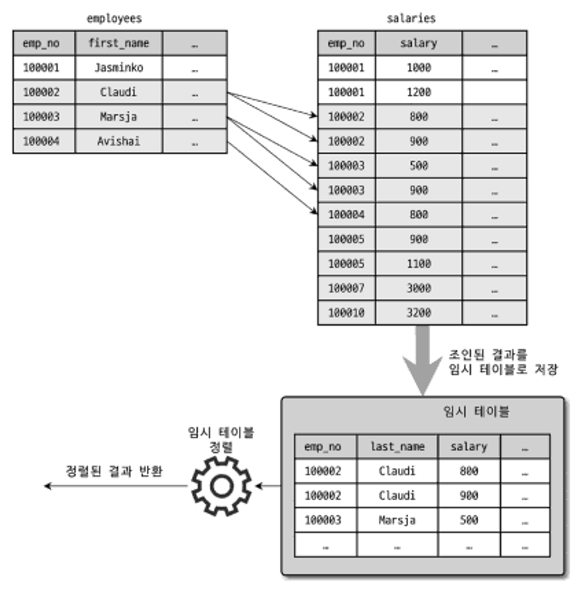

09_옵티마이저와 힌트
===

서버로 요청된 쿼리의 결과가 동일해도 내부적으로 처리하는 방법은 다양하다.

다양한 방법 중 최소의 비용이 드는 최적화된 방법을 찾아야 한다.

MySQL의 옵티마이저는 쿼리를 최적으로 실행하기 위해 테이블 데이터 분포 통계 정보를 참조하며,
기본 데이터를 비교해 실행 계획을 수립하는 것을 담당한다.

`EXPLANE` 명령으로 쿼리의 실행 계획을 확인할 수 있다.

MySQL 서버가 데이터를 가공하는 기본 절차와 최적화에 대해 살펴보겠다.

## 개요

### 1. 쿼리 실행 절차

```
3단계 실행 절차

1. SQL 파싱 단계
- 사용자로부터 요청된 SQL 문장을 쪼개 서버가 이해할 수 있는 수준으로 분리. (파스 트리)
- SQL 파서 모듈로 처리하며, SQL 파스 트리가 만들어진다.

2. 최적화 및 실행 계획 수립 단계
- 파싱 정보(파스 트리)를 참조하면서 어떤 테이블, 인덱스를 이용할지 선택.
-  다음의 내용을 옵티마이저에서 처리
  > 불필요한 조건 제거 및 복잡한 연산의 단순화
  > 여러 테이블의 조인이 있는 경우 어떤 순서로 테이블을 읽을지 결정
  > 각 테이블에 사용된 조건과 인덱스 통계 정보를 이용해 사용할 인덱스를 결정
  > 가져온 레코드들을 임시 테이블에 넣고 다시 한번 가공해야 하는지 결정

3. 실행 계획 수행 단계
- 두번째 단계에서 결정된 실행 계획을 이용해 스토리지 엔진으로부터 데이터를 가져옴.
- 읽어온 레코드를 조인, 정렬 하는 작업 수행.
```

### 2. 옵티마이저의 종류
옵티마이저는 데이터베이스 서버에서 두뇌와 같은 역할을 담당하는데
크게 두가지 종류로 나눌 수 있다.

- 규칙 기반 최적화 (Rule-based optimizer, RBO)
  - 초기 버전의 오라클에서 사용했던 방법.
  - 대상 테이블 선택도 등을 고려하지 않고 우선순위에 따라 실행 계획을 수립하는 방식이다.
  - 사용자 데이터 분포도 및 통계를 고려하지 않기에, 같은 쿼리에 대해 항상 같은 실행 방법을 수행한다.

- 비용 기반 최적화 (Cost-based optimizer, CBO)
  - 현재 대부분의 DBMS가 선택하고 있는 방법.
  - 쿼리 처리를 위한 여러 방법을 만들고, 각 단위 작업 비용, 부하 정보와 대상 테이블의
    예측 통계를 이용해 실행 계획 별 비용을 산출한다.
  - 산출된 실행 계획 비용 중 최소 비용을 선택해 쿼리를 실행 한다.


-------------------
# 기본 데이터 처리

## 1. 풀 테이블 스캔과 풀 인덱스 스캔

**풀 테이블 스캔**
인덱스를 사용하지 않고 테이블의 데이터를 처음부터 끝까지 읽어서 요청된 작업을 처리.</br>
- 옵티마이저가 풀 테이블 스캔을 하는 경우
  - 테이블의 레코드 건수가 너무 작아서 인덱스를 통해 읽는 것보다 풀 테이블 스캔을 하는 편이 더 빠른 경우
  - WHERE 절이나 ON 절에 인덱스를 이용할 수 있는 적절한 조건이 없는 경우
  - 인덱스 레인지 스캔을 사용할 수 있는 쿼리라고 하더라도 옵티마이저가 판단한 조건 일치 레코드 건수가 너무 많은 경우

일반적으로 테이블의 전체 크기는 인덱스보다 훨씬 크기 때문에 </br>
테이블을 처음부터 끝까지 읽는 작업은 많은 디스크 읽기가 필요하다.

InnoDB 스토리지 엔진은 특정 테이블의 연속된 데이터 페이지가 읽히면 </br>
백그라운드 스레드에 의해 Read ahead 작업이 자동으로 시작된다. </br>
Read ahead 는 필요한 데이터를 미리 예측해 디스크에서 읽어 버퍼 풀에 가져다 두는 것이다.

풀 테이블 스캔이 실행되면 처음 몇 페이지는 포그라운드 스레드가 실행하다 백그라운드 스레드로 넘긴다.</br>
이때 한 번에 최대 64개의 데이터 페이지까지 읽어서 버퍼 풀에 저장한다.</br>
포그라운드 스레드는 미리 버퍼 풀에 준비된 데이터를 사용하면 되므로 쿼리가 상당히 빨리 처리된다.</br>
`innodb_read_ahead_threshold` 시스템 변수를 이용해 Read ahead 임계값을 설정할 수 있다.</br>
Read ahead 는 풀 인덱스 스캔에서도 동일하게 사용된다.

```sql
SELECT COUNT(*) FROM employees;
```

위의 쿼리 예시는 조건 없는 조회 쿼리 이므로 풀 테이블 스캔을 할것으로 예상되나, 실제 풀 인덱스 스캔을 한다.</br>
이유는 단순 레코드 건수만 필요한 쿼리이므로 용량이 작은 인덱스 스캔을 선택해 디스크 읽기 횟수를 줄이기 때문이다.


## 2. 병렬 처리

MySQL 8.0 부터 쿼리 병렬처리(하나의 쿼리를 여러 스레드가 작업을 나누어 동시에 처리)가 가능하다. </br>
`innodb_parallel_read_threads` 시스템 변수를 이용해 하나의 쿼리를 최대 몇 개의 스레드를 이용해서 처리할지 설정한다.
```sql
SET SESSION innodb_parallel_read_threads=4;
```
8.0 버전에서는 아무런 WHERE 조건 없이 단순 테이블 전체 건수 가져오는 쿼리만 병렬 처리할 수 있다. </br>
병렬 처리용 스레드 개수를 늘리면 수행 시간이 줄어들지만, 서버에 장착된 CPU의 코어 개수를 넘어서는 경우에는 오히려 성능이 떨어질 수도 있다.


## 3. ORDER BY 처리 (Using filesort)

레코드 1~2건을 가져오는 쿼리를 제외하면 대부분의 SELECT 쿼리에서 정렬은 필수적으로 사용된다.


|     정렬을 처리하는</br> 두가지 방식     | 장점                                                                                                            | 단점                                                      |
|:----------------------------:|---------------------------------------------------------------------------------------------------------------|---------------------------------------------------------|
|             인덱스              | INSERT, UPDATE, DELETE 쿼리가 실행될 때 이미 인덱스가 정렬돼 있어서 순서대로 읽기만 하면 되므로 매우 빠르다.                                      |  INSERT, UPDATE, DELETE 작업 시 부가적인 인덱스 추가/삭제 작업이 필요하므로 느리다.</br> 인덱스 때문에 디스크 공간이 더 많이 필요하다.</br> 인덱스의 개수가 늘어날수록 InnoDB의 버퍼 풀을 인덱스 이용 위한 메모리가 많이 필요하다.   |
|           Filesort           | 인덱스를 생성하지 않아도되므로 인덱스를 이용할 때 Filesort 이용의 단점이 장점으로 바뀐다.</br> 정렬해야 할 레코드가 많지 않으면 메모리에서 Filesort 가 처리되므로 충분히 빠르다. |  정렬 작업이 쿼리 실행 시 처리되므로 레코드 대상 건수가 많아질수록 쿼리의 응답 속도가 느리다.                          |

**인덱스 이용이 힘든 경우**
- 정렬 기준이 너무 많아서 요건별로 모두 인덱스를 생성하는 것이 불가능한 경우
- GROUP BY의 결과 또는 DISTINCT 같은 처리의 결과를 정렬해야 하는 경우
- UNION 의 결과와 같이 임시 테이블의 결과를 다시 정렬해야 하는 경우
- 랜덤하게 결과 레코드를 가져와야 하는 경우

ORDER BY/GROUP BY 처리에 인덱스를 사용하지 못하는 경우, MySQL은 Filesort 알고리즘을 통해 데이터를 정렬한다.

인덱스를 이용하지 않고 별도의 정렬 처리를 수행했는지는 실행 계획의 Extra 칼럼에 Using filesort 메시지가 표시되는지 여부로 판단한다.

#### filesort 알고리즘 flow


1. 데이터 스캔 및 where 필터 처리 후 레코드를 소트 버퍼에 저장한다.
   정렬조건 컬럼 값과 데이터 포지션 정보를 버퍼에 저장하고, InnoDB 의 경우 pk 값이 버퍼에 저장된다.  
   (정렬 알고리즘에 따라 Single-pass, Two-pass 방식으로 나뉨. 뒤에 설명)
2. 소트 버퍼가 차면 Quick sort 처리하여 결과를 임시 파일에 저장하고, 위 과정에 부합하는 모든 레코드를 읽을 때까지 반복한다.
3. 생성된 임시 파일들을 merge 한다. merge 횟수는 상태 변수에 누적 카운트된다.</br>
   sort_buffer_size 가 작은 경우 sort_merge_pass 변수 값이 커진다.
4. merge 완료된 Result set 을 리턴한다.</br>
   결과 순서대로 데이터를 읽는 경우에 많은 Random I/O가 발생하므로, 별도의 버퍼(read_rnd_buffer 환경 변수)에서 결과 파일의 위치 정보를 정렬하여 Sequential I/O로 유도한다.

참고: https://blog.naver.com/seuis398/70039224614

#### MySQL Connection 별 메모리 사용량
참고: https://jaesong.tistory.com/17147220


#### 메모리 영역 설명 
참고: https://blog.ex-em.com/1682


### 1) 소트 버퍼 Sort buffer

- 소트 버퍼는 정렬을 수행하기 위해 별도의 메모리 공간을 할당받아서 사용하는 메모리 공간
- 쿼리의 실행이 완료되면 즉시 시스템으로 반납된다.
- 정렬해야 할 레코드의 건수가 소트 버퍼로 할당된 공간보다 크다면 정렬해야 할 레코드를 여러 조각으로 나눠서 처리하는데</br> 이 과정에서 임시 저장을 위해 디스크를 사용한다.
- 기본 sort buffer size 262144, 262KB.</br>
  책에서 테스트 시 256KB-8MB 사이가 최적의 성능을 보였고, 문서에서는 리눅스 환경 에서 256KB-2MB 사이를 권장한다. 설정된 사이즈를 넘길경우 memory 문제가 생길 수 있다.</br>
  (참고: https://dev.mysql.com/doc/refman/8.0/en/server-system-variables.html#sysvar_sort_buffer_size)
- 멀티 머지: 메모리의 소트 버퍼에서 정렬 하고, 그 결과를 임시로 디스크에 기록하고 다음 레코드를 가져와 이 작업을 병합, 반복한다.
- 수행된 멀티 머지 횟수는 `sort_merge_passes` 변수에 누적 집계된다.
- 소트 버퍼는 세션 메모리 영역에 해당하므로 클라이언트가 공유하지 않는다.
- 커넥션이 많고, 정렬 작업이 많을수록 소트 버퍼로 소비되는 메모리 공간이 커진다.


### 2) 정렬 알고리즘


레코드를 정렬할 때 레코드 전체를 소트 버퍼에 담을지 또는 정렬 기준 칼럼만 소트 버퍼에 담을지에 따라
싱글 패스(Single-pass)/투 패스(Two-pass) 2가지 정렬 모드로 나눈다.

- MySQL 서버의 3가지 정렬 방식
  - <sort_key, rowid>: 정렬 키와 레코드의 로우 아이디(Row ID)만 가져와서 정렬하는 방식
  - <sort_key, additional_fields>: 정렬 키와 레코드 전체를 가져와서 정렬하는 방식으로, 레코드의 칼럼들은 고정 사이즈로 메모리 저장
  - <sort_key, packed_additional_fields>: 정렬 키와 레코드 전체를 가져와서 정렬하는 방식으로, 레코드의 칼럼 들은 가변 사이즈로 메모리 저장


### 3) 싱글 패스 Single-pass
- <sort_key, additional_fields>, <sort_key, packed_additional_fields>
- 소트 버퍼에 정렬 기준 칼럼을 포함해 SELECT 대상이 되는 칼럼 전부를 담아서 정렬을 수행하는 정렬 방식이다 </br>
  처음 employees 테이블을 읽을때 정렬에 필요하지 않은 last_name 칼럼까지 전부 읽어서 소트 버퍼에 담고 정렬을 수행한다.</br>
  정렬이 완료되면 정렬 버퍼의 내용을 그대로 클라이언트로 넘겨준다.</br>
  투패스 방식인 pk 값으로 한번더 데이터에 access 하는것을 줄이기에 개선된 알고리즘으로 추가되었지만, 투패스 방식보다 더 많은 소트 버퍼 공간이 필요하다.


### 4) 투 패스
- <sort_key, rowid>
- 정렬 대상 칼럼과 프라이머리 키 값만 소트 버퍼에 담아서 정렬을 수행하고, 정렬된 순서대로 다시 프라이머리 키로 테이블을 읽어서 SELECT 할 칼럼을 가져오는 방식이다.
- 처음 `employees` 테이블을 읽을 때는 정렬에 필요한 `first_name` 칼럼과 프라이머리 키인 `emp_no` 만 읽어서 정렬을 수행한다.
- 레코드 크기가 `max_length_for_sort_data` 설정 값보다 클때 (기본값 1KB), </br> BLOB, TEXT 타입 컬럼을 SELECT 할때에는 투패스 정렬 방식을 사용한다.


### 5) 정렬 처리 방법
- 쿼리에 ORDER BY가 사용되면 3가지 처리 방법 중 하나로 정렬되고 뒤로갈수록 처리 속도가 떨어진다.
  - a. 인덱스를 사용한 정렬
  - b. 조인에서 드라이빙 테이블만 정렬 (Using filesort 표시)
  - c. 조인에서 조인 결과를 임시 테이블로 저장 후 정렬 (Using temporary; Using filesort 표시)
- 먼저 옵티마이저는 정렬 처리를 위해 인덱스를 이용할 수 있을지 검토한다.
- 인덱스를 이용할 수 있다면 별도의 Filesort 과정 없이 인덱스를 순서대로 읽어서 결과를 반환한다.
- 인덱스를 사용할 수 없다면 WHERE 조건에 일치하는 레코드를 검색해 정렬 버퍼에 저장하면서 정렬을 처리(Filesort)한다.

#### a. 인덱스를 사용한 정렬
인덱스를 이용한 정렬을 위해서는 반드시 ORDER BY에 명시된 칼럼이 제일 먼저 읽는 테이블(드라이빙)에 속하고, ORDER BY의 순서대로 생성된 인덱스가 있어야 한다.</br>
WHERE 절에 첫 번째로 읽는 테이블의 칼럼에 대한 조건이 있다면, 그 조건과 ORDER BY는 같은 인덱스를 사용할 수 있어야 한다.</br>
인덱스를 이용해 정렬이 처리되는 경우에는 실제 인덱스의 값이 정렬돼 있기 때문에 인덱스의 순서대로 읽기만 하면 된다.</br>
별도의 정렬을 위한 추가 작업을 수행하지 않는다


#### b. 조인에서 드라이빙 테이블만 정렬
조인이 수행되면 결과 레코드의 건수와 크기도 늘어난다.</br>
차선책으로 조인을 실행하기 전에 첫 번째 테이블의 레코드를 먼저 정렬한 다음 조인을 실행할 수 있다.</br>
이 방법으로 정렬이 처리되려면 조인에서 첫 번째로 읽히는 테이블(드라이빙 테이블)의 칼럼만으로 ORDER BY 절을 작성해야 한다.


```sql
SELECT *
FROM employees e, salaries s 
WHERE s.emp_no=e.emp_no
    AND e.emp_no BETWEEN 100002 AND 100010
ORDER BY e.last_name;
```

WHERE 절이 다음 2가지 조건을 갖추고 있다면 드라이빙 테이블로 선택한다.
- WHERE 절의 검색 조건(“emp_no BETWEEN 100001 AND 100010”)은 employees 테이블의 프라이머리 키를 이용해 검색하면 작업량을 줄일 수 있다.
- 드리븐 테이블(salaries)의 조인 칼럼인 emp_no 칼럼에 인덱스가 있다.

옵티마이저는 드라이빙 테이블만 검색해서 정렬을 수행하고, 그 결과와 salaries 테이블은 조인한 것이다.


i. 인덱스를 이용해 “emp_no BETWEEN 100001 AND 100010” 조건을 만족하는 9건 검색</br>
ii. 검색 결과를 last_name 칼럼으로 정렬을 수행(Filesort)</br>
iii. 정렬된 결과를 순서대로 읽으면서 salaries 테이블과 조인을 수행해 86건의 결과를 가져옴.


#### c. 조인에서 조인 결과를 임시 테이블로 저장 후 정렬
2개 이상의 테이블을 조인해서 그 결과를 정렬해야 한다면 임시 테이블이 필요할 수도 있다.</br>
이 방법은 정렬의 3가지 방법 가운데 정렬해야 할 레코드 건수가 가장 많기 때문에 가장 느린 정렬 방법이다.

```sql
SELECT *
FROM employees e, salaries s 
WHERE s.emp_no=e.emp_no
    AND e.emp_no BETWEEN 100002 AND 100010
ORDER BY s.salary;
```

위 쿼리의 실행 계획을 살펴보면 Extra 칼럼에 `Using temporary; Using filesort` 가 표시된다.
드리븐 테이블 컬럼 salary 로 정렬하므로, 조인 결과를 임시 테이블에 저장하고 그 결과를 다시 정렬처리하게 된다.




#### d. 정렬 처리 성능 비교
LIMIT 은 테이블이나 처리 결과의 일부만 가져오기 때문에 MySQL 서버가 처리해야 할 작업량이 줄어드는 역할을 한다.</br>
그런데 우선 조건을 만족하는 레코드를 모두 가져와 정렬을 수행하거나 그루핑 작업을 실행해야 LIMIT 건수를 제한할 수 있다.

**쿼리가 처리되는 2가지 방식**

1. 스트리밍 방식</br>
   빠른 응답시간을 위해 사용하는 방식이다.</br>
   처리할 데이터의 양과 관계없이 조건에 일치하는 레코드가 검색될때마다 바로 클라이언트에 전송하는 방식이다.</br>
   풀 테이블 스캔의 결과가 아무 버퍼링 처리나 필터링 과정없이 클라이언트로 스트리밍 된다.</br>
   쿼리를 요청하고 곧바로 첫번째 레코드를 전달받는다.


2. 버퍼링 방식</br>
   ORDER BY 나 GROUP BY 처리는 쿼리 결과 스트리밍이 불가능하다.</br>
   레코드 검색 후 정렬 또는 그루핑작업 하는 동안 클라이언트는 대기해야 한다. 이 방식을 버퍼링 방식 이라고 한다.


> MySQL 서버가 스트리밍 방식으로 처리해서 반환해도
> 클라이언트의 JDBC 라이브러리를 사용한다면 서버로부터 받는 레코드를 일단 내부 버퍼에 담아두고 마지막 결과를 받으면 애플리케이션에 반환한다.
> 이는 불필요한 네트워크 요청을 최소화 하여 전체 처리량을 높이기 위해서이다.
> 하지만 대량의 데이터를 가져와야 할떄 전송방식을 스트리밍 방식으로 변경할 수 있다.

정렬 처리 방식 중 인덱스를 사용한 정렬 방식만 스트리밍 처리 방식이고, 나머지는 버퍼링되서 정렬된다.</br>
어떤 테이블이 먼저 드라이빙 되어 조인되는지도 중요하지만 어떤 정렬 방식으로 처리되는지가 큰 성능 차이가 나므로,</br>
최소 드라이빙 테이블 정렬로 구성하는 것이 좋은 튜닝 방법이다.


> 인덱스를 사용하지 못하는 쿼리는 LIMIT로 조회하더라도 성능이 크게 좋아지지 않는다.


## 4. GROUP BY 처리

GROUP BY 또한 ORDER BY와 같이 쿼리가 스트리밍된 처리를 할 수 없다.</br>

HAVING 절은 GROUP BY 결과에 대해 필터링 역할을 수행한다.</br>

인덱스를 차례대로 읽는 인덱스 스캔 방법과 인덱스를 건너뛰면서 읽는 루스 인덱스 스캔이라는 방법으로 나뉜다.</br>

인덱스를 사용하지 못하는 쿼리에서 임시 테이블을 사용한다.</br>

### 1) 인덱스 스캔을 이용하는 GROUP BY (타이트 인덱스 스캔)
- 조인의 드라이빙 테이블에 속한 칼럼만 이용해 그루핑할 때 GROUP BY 칼럼으로 이미 인덱스가 있다면,
  그 인덱스를 차례대로 읽으면서 그루핑 작업을 수행하고 그 결과로 조인을 처리한다.

- 쿼리 실행 계획 Extra 칼럼에 코멘트가 표시되지 않는다.

### 2) 루스 인덱스 스캔을 이용하는 GROUP BY
- 그룹 함수 Aggregation function 등의 그룹값을 처리해야 해서 임시 테이블이 필요할 때도 있다.

- 루스 인덱스 스캔은 인덱스의 레코드를 건너뛰면서 필요한 부분만 읽어서 가져온다.

- 쿼리 실행 계획 Extra 칼럼에 `Using index for group-by` 코멘트 표시.

```sql
EXPLAIN 
    SELECT emp_no 
    FROM salaries 
    WHERE from_date='1958-03-01' 
    GROUP BY emp_no;
```

salaries 테이블의 인덱스는 (emp_no, from_date)로 생성돼 있다. </br>

위의 쿼리 문장에서 WHERE 조건은 인덱스 레인지 스캔 접근 방식으로 이용할 수 없는 쿼리지만,
실행 계획은 인덱스 레인지 스캔을 이용했다.

**실행 순서**

1. (emp_no, from_date) 인덱스를 차례대로 스캔하면서 `emp_no` 의 첫 번째 유일한 값(그룹 키) "10001"을 찾아낸다.
2. (emp_no, from_date) 인덱스에서 `emp_no` 가 '10001'인 것 중에서 `from_date` 값이 '1985-03-01'인 레코드만 가져온다.
   이 검색 방법은 1번 단계에서 알아낸 '10001' 값과 쿼리의 WHERE 절에 사용된 "from_date='1985-03- 01'" 조건을 합쳐서
   "emp_no=10001 AND from_date='1985-03-01'" 조건으로 (emp_ no, from_date) 인덱스 를 검색하는 것과 거의 흡사하다.
3. (emp_no, from_date) 인덱스에서 `emp_no` 의 그다음 유니크한(그룹 키) 값을 가져온다.
4. 3번 단계에서 결과가 더 없으면 처리를 종료하고, 결과가 있다면 2번 과정으로 돌아가서 반복 수행한다.

_** 루스 인덱스 스캔을 통한 GROUP BY 참고_
</br>


인덱스에서 WHERE 조건을 만족하는 범위 전체를 다 스캔할 필요가 없다는 걸 옵티마이저가 알고있기 때문에 </br>
조건에 만족하지 않는 레코드는 무시하고 다음 레코드로 이동한다.


- 루스 인덱스 스캔은 단일 테이블에 대해 수행되는 GROUP BY 처리에만 사용할 수 있다.
- Group by 또는 집합 함수 가운데 Max() 또는 Min() 함수에 대해 최적화를 하는경우 사용된다.
- 프리픽스(컬럼값의 앞쪽 일부만으로 생성된 인덱스) 인덱스는 루스 인덱스 스캔을 사용할 수 없다.
- 루스 인덱스 스캔은 분포도가 좋지 않은 인덱스일수록 더 빠른 결과를 만들어 낸다.
- 루스 인덱스 스캔은 임시 테이블이 필요하지 않다.


> ** 루스 인덱스 스캔 판별 예시 </br>
> ** (col1, col2, col3) 칼럼으로 생성된 tb_test 테이블
>
> // MIN(), MAX() 이 외의 집합 함수가 사용 됐기에 불가. </br>
> SELECT col1, SUM(col2) FROM tb_test GROUP BY col1; </br>
>
> // GROUP BY 에 사용된 칼럼이 인덱스 구성 칼럼의 왼쪽부터 일치하지 않아 불가. </br>
> SELECT col1, col2 FROM tb_test GROUP BY col2, col3; </br>
>
> // SELECT 절의 칼럼이 GROUP BY 와 일치하지 않아 불가.</br>
> SELECT col1, col3 FROM tb_test GROUP BY col1, col2;
>
> // 가능.
> SELECT DISTINCT col1, col2 FROM tb_test;</br>
> SELECT col1, MIN(col2) FROM tb_test GROUP BY col1;</br>
> SELECT MAX(col3), MIN(col3), col1, col2 FROM tb_test WHERE col2 > const GROUP BY col1, col2;

### 3) 임시 테이블을 사용하는 GROUP BY
- GROUP BY 기준 칼럼 과 관계없이 인덱스를 사용하지 못할 때 이 방식으로 처리된다.

```sql
EXPLAIN
    SELECT e.last_name, AVG(s.salary)
    FROM employees e, salaries s 
    WHERE s.emp_no=e.emp_no
    GROUP BY e.last_name;
```

실행 계획에서는 Extra 칼럼에 Using temporary 가 표시 됐다.</br>

임시 테이블이 사용된 것은 테이블 풀 스캔 하기 때문이 아니라 인덱스를 사용할 수 없는 GROUP BY 이기 떄문이다.</br>

GROUP BY, ORDER BY 함께 사용시 정렬 작업을 실행한다.</br>

GROUP BY가 필요한 경우 내부적으로 GROUP BY 절의 칼럼들로 구성된 유니크 인덱스를 가진 임시 테이블을 만들어서 중복 제거와 집합 함수 연산을 수행한다.</br>

위의 쿼리를 처리하기 위해 다음의 임시 테이블을 만들고, 조인 결과를 한 건씩 가져와 중복체크 하면서 INSERT 또는 UPDATE 를 실행한다.</br>
별도의 정렬 작업 없이 GROUP BY 가 처리된다.

```sql
CREATE TEMPORARY TABLE ... (
       last_name VARCHAR(16),
       salary INT,
       UNIQUE INDEX ux_lastname (last_name)
)
```

## 5. DISTINCT 처리

특정 칼럼의 유니크한 값만 조회하려면 SELECT 쿼리에 DISTINCT를 사용한다.

경우에 따라 키워드가 영향을 미치는 범위가 달라진다.

집합 함수와 같이 DISTINCT가 사용되는 쿼리의 실행 계획에서 DISTINCT 처리가 인덱스 사용하지 못할 시 항상 임시테이블이 필요하다.</br>
(이 경우 실행계획 Extra 에는 메시지가 출력되지 않음)

### 1) SELECT DISTINCT ...
이 경우 GROUP BY 와 동일한 방식으로 처리된다.</br>
GROUP BY를 수행하는 쿼리에 ORDER BY 절이 없으면 정렬을 사용하지 않기 때문에 다음의 두 쿼리는 내부적으로 같은 작업을 수행한다.

그 둘의 차이는, GROUP BY 는 집계가 가능하고, DISTINCT 는 특정 컬럼에 어떤 데이터가 있는지 확인하거나 중복된 데이터를 하나로 쳐서 COUNT 하고 싶을 떄 사용한다.

```sql
SELECT DISTINCT emp_no FROM salaries;
SELECT emp_no FROM salaries GROUP BY emp_no;
```

DISTINCT 키워드는 조회되는 모든 칼럼에 영향을 미친다. </br>
이것은 일부 칼럼만 유니크하게 조회하는 것은 아니고 레코드를 유니크하게 조회하는 것이다.

### 2) 집합 함수와 함께 사용된 DISTINCT
COUNT(), MIN(), MAX() 같은 집합 함수 내에서 DISTINCT 키워드가 사용될 경우 그 집합 함수의 인자로 전달된 칼럼값이 유니크한 것들을 가져온다. </br>

집합 함수가 없는 SELECT 쿼리에서 DISTINCT 는 조회 하는 모든 칼럼의 조합이 유니크한 것들만 가져온다.</br>

```sql
EXPLAIN SELECT COUNT(DISTINCT s.salary)
	   FROM employees e, salaries s
       WHERE e.emp_no=s.emp_no
       AND e.emp_no BETWEEN 100001 AND 100100;
```
위 쿼리는 내부적으로 COUNT(DISTINCT s.salary) 를 처리하기 위해 임시 테이블을 사용한다. 하지만 이 쿼리 실행 계획에는 임시 테이블을 사용한다는 메시지는 표기되지 않는다.</br>

위 쿼리의 경우 employees 테이블과 salaries 테이블을 조인한 결과에서 salary 컬럼의 값만 저장하기 위한 임시 테이블을 만들어서 사용한다. </br>
이 때, 임시 테이블의 salary 컬럼에는 유니크 인덱스가 생성되기에 레코드 건수가 많아진다면 상당히 느려질 수 있다.

```sql
EXPLAIN SELECT COUNT(DISTINCT s.salary), COUNT(DISTINCT e.last_name)
	   FROM employees e, salaries s
       WHERE e.emp_no=s.emp_no
         AND e.emp_no BETWEEN 100001 AND 100100;
```
위 쿼리를 처리하기위해 s.salary 컬럼의 값을 저장하는 임시 테이블과 </br> 
e.last_name 컬럼의 값을 저장하는 다른 임시 테이블이 필요해 전체적으로 2개의 임시 테이블을 사용한다.
DISTINCT 처리를 위해 인덱스를 사용할 수 없기 때문에 임시 테이블이 필요하다.

```sql
mysql> SELECT COUNT(DISTICT emp_no) FROM employees;
mysql> SELECT COUNT(DISTICT emp_no) FROM dept_emp GROUP BY dept_no;
```
위 쿼리 같이 인덱스된 컬럼에 대해서만 DISTINCT 처리를 수행할 때는 인덱스 풀/레인지 스캔을 하면서 임시 테이블 없이 수행할 수 있다.


## 6. 내부 임시 테이블 사용

- MySQL 엔진이 내부 임시 테이블 (Internal temporary table) 을 사용하는 것은 일반적인 임시 테이블과 다르다. </br>
내부적 임시 테이블은 특정 케이스를 제외하고는 처음에 메모리에 생성 되었다가 테이블 크기가 커지면 디스크로 옮겨진다.
- 다른 세션이나 쿼리에서는 볼수 없고 사용 불가능하다
- 내부 임시 테이블은 쿼리 처리가 완료되면 자동으로 삭제 된다.

### 1) 메모리 임시 테이블과 디스크 임시 테이블

8.0 부터 메모리는  가변 길이 타입을 지원하는 TempTable 스토리지 엔진 사용이 가능하고, </br>
디스크에 저장되는 임시 테이블은 트랜잭션 가능한 InnoDB 스토리지 엔진을 사용한다. </br>
`internal_tmp_mem_storage_engine` 변수를 MEMORY 와 TempTable 중 설정. 기본 TempTable.</br>
`temptable_max_ram` 변수로 메모리 공간 크기 설정. 기본 1GB.</br>
임시 테이블이 커져 디스크로 기록하게 될때 `MMAP 파일`, `InnoDB 테이블` 선택해 기록한다. </br>
temptable_use_mmap 변수로 설정. 기본 `MMAP 파일`. MMAP 파일 전환시의 오버헤드가 더 적기 떄문.</br>
처음부터 디스크 테이블로 생성되는 경우는 `internal_tmp_disk_storage_engine` 의 설정 엔진이 사용된다. 기본 InnoDB.

### 2) 임시 테이블이 필요한 쿼리

| **MySQL 엔진에서 별도의 데이터 가공 작업이 필요하며, 내부 임시 테이블 생성하는 케이스** |      Extra      | 유니크 인덱스 |
|:---------------------------------------------------------------------|:---------------:|---------|
| ORDER BY와 GROUP BY에 명시된 칼럼이 다른 쿼리                                    | Using temporary | O       |
| ORDER BY와 GROUP BY에 명시된 칼럼이 조인의 순서상 첫 번째 테이블이 아닌 경우                  | Using temporary | O       |
| DISTINCT 와 ORDER BY가 동시에 쿼리에 존재하는 경우 또는 DISTINCT 가 인덱스로 처리되지 못하는 쿼리  |        -        | O       |
| UNION 이나 UNION DISTINCT 가 사용된 쿼리 (select_type 칼럼이 UNION RESULT 인 경우) |        -        | O       |
| 쿼리의 실행 계획에서 select_type 이 DERIVED 인 쿼리                               |        -        | X       |


### 3) 임시 테이블이 디스크에 생성되는 경우

내부 임시 테이블은 기본적으로 메모리상 만들어지나 다음의 조건에서는 디스크 기반의 임시 테이블 사용한다.

- UNION 이나 UNION ALL 에서 SELECT 되는 칼럼 중 길이가 512바이트 이상인 크기의 칼럼이 있는 경우
- GROUP BY 나 DISTINCT 칼럼에서 512바이트 이상인 크기의 칼럼이 있는 경우
- 메모리 임시 테이블 크기가 tmp_table_size, max_heap_table_size 시스템 변수보다 크거나 temptable_max_ram 시스템 변수 값보다 큰 경우


### 4) 임시 테이블 관련 상태 변수
`Using temporary` 표시로 구체적인 실행계획을 알 수 없다.(메모리 또는 디스크에서 처리되는지, 몇개의 임시 테이블이 생겼는지..) </br>
구체적인 사항을 확인하려면 서버 상태변수를 확인하면 된다.

```shell
> SHOW SESSION STATUS LIKE 'Created_tmp%';

Variable_name          |Value|
-----------------------+-----+
Created_tmp_disk_tables|0    |
Created_tmp_files      |15   |
Created_tmp_tables     |0    |
```

https://dev.mysql.com/doc/refman/8.0/en/internal-temporary-tables.html


-------------------
# 고급 최적화

옵티마이저 옵션은 크게 조인과 관련된 옵티마이저 옵션과 옵티마이저 스위치로 구분한다.

## 1. 옵티마이저 스위치 옵션
optimizer_switch 시스템 변수를 이용해서 제어.

여러개의 옵션을 세트로 묶어 설정하는 방식으로 사용한다.</br>
(스위치 옵션: https://dev.mysql.com/doc/refman/8.0/en/switchable-optimizations.html)

default, on, off 중 하나를 설정하는데 default 는 기본값 설정이다.

```sql
-- 글로벌 또는 현재 커넥션 으로 설정 가능.
SET [GLOBAL|SESSION] optimizer_switch='index_merge=on,index_merge_union=on,...';
```

### 1) MRR(Multi-Range Read) 과 배치 키 엑세스 batched_key_access 
- **네스티드 루프 조인** Nested Loop Join 
  - 드라이빙 테이블 레코드를 한 건 읽어 드리븐 테이블의 일치하는 레코드를 찾아 조인을 수행하는 것.
  - 조인처리는 MySQL 엔진이, 실제 레코드 검색은 스토리지 엔진이 담당하기 때문에, 드라이빙 테이블의 레코드를 찾으면 스토리지 엔진에서는 최적화를 수행할 수 없다.

- 이 단점을 보완하기 위해 조인 대상 테이블 중 하나로부터 레코드를 읽어 조인 버퍼에 버퍼링한다.</br> 드라이빙 테이블의 레코드를 읽어 드리븐 테이블과 조인은 즉시 실행하지 않고 조인대상을 버퍼링 한다.
- 조인 버퍼에 레코드가 다 차면 버퍼링된 레코드를 스토리지 엔진으로 한번에 요청한다. 따라서 스토리지 엔진이 데이터 페이지에 정렬된 순서로 접근해 페이지 읽기를 최소화 할 수 있다.
- MRR 을 이용한 조인방식을 BKA 조인이라 한다.  
- 기본적으로 비활성화 되어있는데, 단점으로 부가적 정렬작업이 필요해지만 오히려 성능이 안좋아질 수 있다.

### 2) 블록 네스티드 루프 조인 block_nested_loop
- 네스티드 루프 조인은 인덱스가 있는 조인 연결 컬럼에 모두 인덱스가 있는 경우 사용되는 조인 방식이다.
- 마치 중첩된 반복 명령을 사용하는 것처럼 작동해서 네스티드 루프 조인이라 한다.
- 블록 네스티드 루프 조인은 조인용으로 별도의 버퍼를 사용하며 Extra 에 "Using Join buffer" 가 표시된다.
- 옵티마이저는 퇴대한 드리븐 테이블의 검색이 인덱스를 사용할 수 있게 실행 계획을 수립하지만, 
어떤 방식으로도 드리븐 테이블의 풀 스캔을 피할 수 없다면 드라이빙 테이블에서 읽은 레코드를 메모리에 캐시한 후 드리븐 테이블과 이 메모리 캐시를 조인하는 형태로 처리한다.
- 메모리 캐시. 조인버퍼 Join buffer 사용. 조인이 완료되면 조인버퍼는 바로 해제됨.


1. ept_emp 테이블의 ix_fromdate 인덱스를 이용해(from_date>'1995-01-01') 조건을 만족하는 레코드를 검색한다.
2. 조인에 필요한 나머지 칼럼을 모두 dept_emp 테이블로부터 읽어서 조인 버퍼에 저장한다.
3. employees 테이블의 프라이머리 키를 이용해 (emp_no<109004) 조건을 만족하는 레코드를 검색한다.
4. 3번에서 검색된 결과(employees)에 2번의 캐시된 조인 버퍼의 레코드(dept_emp)를 결합해서 반환한다.

_** MySQL 8.0.20 부터는 블록 네스티드 루프 조인은 더이상 사용되지 않고 해시 조인 알고리즘으로 대체되어 사용된다._

### 3) 인덱스 컨디션 푸시 다운
- 5.6 버전부터는 인덱스 컨디션 푸시다운이라는 기능이 도입되었다.
- 인덱스를 범위 제한 조건으로 사용하지 못한다고 하더라도 인덱스에 포함된 칼럼의 조건이 있다면,  
모두 같이 모아서 스토리지 엔진으로 전달할 수 있게 핸들러 API가 개선되었다.

```sql
ALTER TABLE employees ADD INDEX ix_lastname_firstname (last_name, first_name);
SET optimizer_switch='index_condition_pushdown=off';

-- 인덱스 푸시다운 off 하고 실행
SELECT * FROM employees WHERE last_name = 'Action' AND first_name LIKE '%sal';
```


인덱스 푸시다운이 작동하지 않을때 Extra 컬럼에 Using where 가 표시된다.
`Using where` 는 스토리지 엔진이 읽어서 반환해준 레코드가 인덱스를 사용할 수 없는 where 조건에 일치하는지 검사하는 과정을 의미한다.


`first_name LIKE '%sal'` 조건을 누가 처리하느냐에 따라 
인덱스에 포함된 `first_name` 칼럼을 이용할지 또는 테이블의 `first_name` 칼럼을 이용할지가 결정된다.</br>
인덱스를 비교하는 작업은 실제 InnoDB 스토리지 엔진이 수행하지만 테이블의 레코드에서 `first_name` 조건을 비교하는 작업은 MySQL 엔진이 수행하는 작업이다.

5.6 버전부터는 인덱스를 범위 제한 조건으로 사용하지 못한다고 하더라도 
인덱스에 포함된 칼럼의 조건이 있다면 모두 같이 모아서 스토리지 엔진으로 전달할 수 있게 핸들러 API가 개선되었다.


위 그림처럼 인덱스를 이용해 최대한 필터링해서 필요한 레코드 1건만 테이블 읽기를 수행하도록 한다.

### 4) 인덱스 확장 use_index_extensions
InnoDB 스토리지 엔진을 사용하는 테이블에서 세컨더리 인덱스에 자동으로 추가된 프라이머리 키를 활용할 수 있게 할지를 결정하는 옵션이다.

InnoDB 스토리지 엔진은 PK 키를 클러스터링 키로 생성한다. 모든 세컨더리 인덱스는 리프노드에 PK 값을 가진다.(8.8 클러스터링 인덱스)

```sql
mysql> CREATE TABLE dept_emp (
    emp_no INT NOT NULL, dept_no CHAR(4) NOT NULL, 
    from_date DATE NOT NULL, to_date DATE NOT NULL, 
    PRIMARY KEY (dept_no,emp_no), 
    KEY ix_fromdate (from_date) 
    ) ENGINE=InnoDB;
```

세컨더리 인덱스 `ix_fromdate`는 데이터 레코드를 찾아가기 위해 
PK인 dept_no와 emp_no 칼럼을 순서대로(PK에 명시된 순서) 포함한다.
그래서 최종적으로 `ix_fromdate` 인덱스는 (from_date, dept_no, emp_no) 조합으로 인덱스를 생성한 것과 흡사하게 작동할 수 있게 된다.

옵티마이저는 `ix_fromdate` 인덱스의 마지막에 (dept_no, emp_no) 컬럼이 숨어있다는 것을 인지하고 실행계획을 수립한다.

실행계획의 `key_len` 컬럼은 쿼리가 인덱스를 구성하는 컬럼 중 어느 컬럼까지 사용했는지를 바이트 수로 보여준다.


### 5) 인덱스 머지 Index Merge
대부분 옵티마이저는 테이블 당 하나의 인덱스를 사용하도록 실행계획을 수립한다.</br>
인덱스 머지 실행계획을 사용하면 하나의 테이블에 2개 이상 인덱스를 이용해 처리 가능하다.

하나의 인덱스만 사용해 작업범위를 줄이는 것이 일반적이지만, 
쿼리에 각 조건이 서로 다른 인덱스를 사용할 수 있고 
조건을 만족하는 레코드 건수가 많을 것으로 예상 될 때 MySQL 서버는 인덱스 머지 실행 계획을 선택한다.

인덱스 머지 실행계획은 결과를 어떤 방식으로 병합할지에 따라 세가지로 나뉜다.
- 인덱스 머지 교집합 Index Merge Intersection Access Algorithm
- 인덱스 머지 합집합 Index Merge Union Access Algorithm
- 인덱스 머지 정렬 후 합집합 Index Merge Sort-Union Access Algorithm

(참고: https://dev.mysql.com/doc/refman/8.0/en/index-merge-optimization.html)

### 6) 인덱스 머지 교집합 Index Merge Intersection Access Algorithm
- 쿼리가 여러개의 인덱스를 각각 검색해서 그 결과의 교집합만 반환한다.
- 2개 이상의 인덱스를 이용해서 나온 여러 결과들을 AND 연산자로 연결할 경우 실행된다.
- 실행계획의 Extra 칼럼에 Using intersect(idx_1, primary) 표시된다면, 
idx_1과 pk로 검색한 두 결과를 교집합했다는 뜻이다. 


그런데 위의 쿼리에서 세컨드 인덱스는 프라이머리 키를 포함하고 있으므로 그냥 ix_firstname 인덱스만 사용하는 것이 성능이 더 좋을것이라 생각할 수도있다.
그러면 index_merge_intersection 을 비활성화 하면 되는데, 현재 커넥션 또는 해당 쿼리만 에도 비활성화 가능하다.

```sql
-- MySQL 서버 전체 비활성화
SET GLOBAL optimizer_switch='index_merge_intersection=off';
-- 현재 커넥션만 비활성화
SET SESSION optimizer_switch='index_merge_intersection=off';
-- 현재 쿼리에서 비활성화
EXPLAIN
    SELECT /*+ SET_VAR(optimizer_switch='index_merge_intersection=off') */ *
    FROM employees
    WHERE first_name='Georgi' AND emp_no BETWEEN 10000 AND 20000;

```

### 7) 인덱스 머지 합집합 Index Merge Union Access Algorithm
- 합집합의 경우는 2개 이상의 인덱스를 이용해서 나온 여러 결과들을 OR 연산자로 연결할 경우 실행된다.
- 두 인덱스로 검색한 값을 합집합한다. 
- 중복되는 데이터는 (세컨더리 인덱스는 이미 PK로 정렬되어 있음) 우선순위 큐 알고리즘을 통해 합치면서 중복을 제거한다.
- 두 조건이 AND로 연결된 경우에는 두 조건 중 하나라도 인덱스를 사용할 수 있으면 인덱스 레인지 스캔으로 쿼리가 실행되지만
OR로 연결된 경우에는 둘 중 하나라도 인덱스를 사용하지 못하면 풀 테이블 스캔으로 처리된다.


### 8) 인덱스 머지 정렬 후 합집합 Index Merge Sort-Union Access Algorithm
- 별도의 정렬이 필요하면 Sort union 알고리즘을 사용한다. 
- 동등 조건을 사용하면 정렬이 필요 없지만, BETWEEN 같은 경우는 정렬이 필요하다. 
이렇게 합집합 연산 전에 정렬을 해야하는 경우 Extra 컬럼에 Using sort_union 문구가 표시된다.

```sql
EXPLAIN 
    SELECT * FROM employees
    WHERE first_name='Matt'
        OR hire_date BETWEEN '1987-03-01' AND '1987-03-31';
```


MySQL 서버는 두 집합의 결과에서 중복을 제거하기 위해 각 집합을 emp_no 컬럼으로 정렬한 다음 중복 제거를 수행한다.


### 9) 세미조인
다른 테이블과 실제 조인을 수행하지는 않고, 단지 다른 테이블에서 조건에 일치하는 레코드가 
있는지 없는지만 체크하는 형태의 쿼리를 세미 조인(Semi-Join)이라고 한다.

```sql
SELECT *
    FROM employees e 
    WHERE e.emp_no IN 
        (SELECT de.emp_no FROM dept_emp de WHERE de.from_date='1995-01-01');
```
쿼리를 보면 dept_emp 테이블을 조회하는 서브쿼리 부분이 먼저 실행되고 다음 employees 테이블에서 일치하는 레코드만 검색할 것으로 기대했다.

하지만 실제는 employees 테이블을 풀스캔 하면서 서브 쿼리의 조건에 일치하는지 비교한다.


따라서 최적화가 필요하다

세미조인 Semi-join `=, IN` 형태 쿼리에서는 다음의 3가지 최적화 방법.
- 세미조인 최적화
- IN-to-EXISTS 최적화
- MATERIALIZATION 최적화

안티 세미 조인 Anti Semi-join 쿼리 최적화
- IN-to-EXISTS 최적화
- MATERIALIZATION 최적화

가장 최근 도입된 **세미조인 최적화**
- Table Pull-out
- Duplicate Weed-out
- First Match
- Loose Scan
- Materialization

Table Pull-out 최적화 전략은 항상 세미조인 보다는 좋은 성능을 내기 때문에 별도로 제어하는 옵티마이저 옵션을 제공하지 않는다.

Fist Match 와 Loose Scan 전략은 firstmatch와 loosescan 옵션으로 사용여부를 결정할 수 있고,

Duplicate Weed-out 과 Materialization 전략은 materialization 스위치로 사용 여부를 선택할 수 있다.

### 10) 테이블 풀-아웃 Table Pull-out


### 11) 퍼스트 매치 First Match


### 12) 루스 스캔 Loose Scan


### 13) 구체화 Materialization


### 14) 중복 제거 Duplicate Weed-out


### 15) 컨디션 팬아웃


### 16) 파생 테이블 머지


### 17) 인비저블 인덱스 


### 18) 스킵 스캔


### 19) 해시 조인


### 20) 인덱스 선호 정렬


## 2. 조인 최적화 알고리즘

### 1) Exhaustive 검색 알고리즘


### 2) Greedy 검색 알고리즘


-------------------
# 쿼리 힌트


## 1. 인덱스 힌트

### 1) STRAIGHT_JOIN

### 2) USE INDEX / FORCE INDEX / IGNORE INDEX

### 3) SQL_CALC_FOUND_ROWS


## 2. 옵티마이저 힌트

### 1) 옵티마이저 힌트 종류

### 2) MAX_EXECUTION_TIME

### 3) SET_VAR

### 4) SEMIJOIN & NO_SEMIJOIN

### 5) SUBQUERY

### 6) BNL & NO_BNL & HASHJOIN & NO_HASHJOIN

### 7) JOIN_FIXED_ORDER & JOIN_ORDER & JOIN_PREFIX & JOIN_SUFFIX

### 8) MERGE & NO_MERGE

### 9) INDEX_MERGE & NO_INDEX_MERGE

### 10) NO_ICP

### 11) SKIP_SCAN & NO_SKIP_SCAN

### 12) INDEX & NO_INDEX
